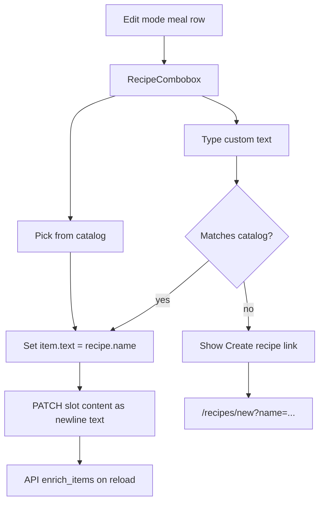

# Recipe combobox in meal slots

## Goal

Replace the plain text input in Edit mode with an **editable combobox** that:
- Lists existing recipes from `GET /v1/recipes`
- On selection, sets the meal line to the recipe **canonical `name`** (keeps current name-based linking — no DB/schema change)
- Allows free text when no recipe matches
- Shows **“Create recipe…”** for unmatched text → navigates to `/recipes/new?name=...`

Linking stays automatic via [`enrich_items()`](backend/app/meals.py) + `name_key` lookup — no backend changes required.



## UI component: `RecipeCombobox`

New file: [`apps/web/src/RecipeCombobox.tsx`](apps/web/src/RecipeCombobox.tsx)

Behavior:
- Text input bound to `value` / `onChange(text)`
- On focus/input: show filtered dropdown (case-insensitive match on `name` and `display_name`)
- Each option shows `display_name || name`; selecting sets **`name`** (canonical) as meal text
- If current text is non-empty and **does not** normalize-match any recipe, show a row below input:
  - `Create recipe “{text}”` → `<Link to={/recipes/new?name=encodeURIComponent(text)}>`
- Keyboard: Enter selects first filtered option; Escape closes list; arrow keys navigate (minimal a11y)
- Keep existing ↗ [`RecipeLink`](apps/web/src/RecipeLink.tsx) beside the input (read-only preview of resolved link)

Reuse normalize helper client-side (mirror backend):

```ts
function normalizeMealName(name: string): string {
  return name.trim().toLowerCase().replace(/\s+/g, " ");
}
```

## Wire into meal editor

Update [`apps/web/src/MealSlotEditor.tsx`](apps/web/src/MealSlotEditor.tsx):
- Add prop `recipes: RecipeSummary[]`
- Replace `<input className="meal-item-input">` with `<RecipeCombobox recipes={recipes} value={item.text} onChange={(text) => updateItem(index, text)} />`

Update [`apps/web/src/App.tsx`](apps/web/src/App.tsx):
- Load recipe list when entering Edit mode (or once on mount): `api.recipes()`
- Pass `recipes` through `MealSlotCell` → `MealSlotEditor`
- After returning from recipe create flow, refresh recipes + reload week (optional: listen to `focus` or reload recipes when `interactionMode === "edit"`)

## Pre-fill new recipe page

Update [`apps/web/src/pages/RecipeEditPage.tsx`](apps/web/src/pages/RecipeEditPage.tsx):
- Read `useSearchParams().get("name")` on `/recipes/new`
- Pre-fill **Name** field when present (only if still empty / on first load)

Example URL: `/recipes/new?name=Mint%20Chutney`

## Styles

Add to [`apps/web/src/styles.css`](apps/web/src/styles.css):
- `.recipe-combobox`, `.recipe-combobox-list`, `.recipe-combobox-option`, `.recipe-combobox-create`
- Match existing meal-row layout; dropdown z-index above grid cells

## Requirements

Add **FR-35** to [`docs/REQUIREMENTS.md`](docs/REQUIREMENTS.md):
- Edit mode meal items use recipe combobox; unmatched text offers create-recipe shortcut

## Out of scope (v1)

- Storing explicit `recipe_id` per meal line (would require slot storage format change)
- Auto-creating recipe stubs via API without user visiting edit page
- Combobox in View mode (stays read-only text + link icon)

## Test checklist

- Pick “Mint Chutney” from dropdown → ↗ links to `/recipes/:id` after save/reload
- Type “New Dish” not in catalog → “Create recipe” link opens `/recipes/new?name=New%20Dish` with name filled
- Custom text that exactly matches a recipe name (any case/spacing) → link appears without using dropdown
- Empty input → no create link, no ↗
