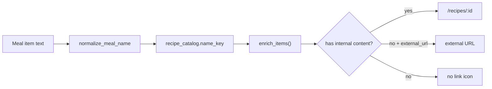

# Recipe storage and edit pages

## Recommendation: store recipes in PostgreSQL (evolve current table)

Keep **`recipe_catalog`** as the single source of truth — it already powers meal-name lookup via `name_key`. Do **not** move recipes back to JSON files for runtime; keep [`public/data/recipe-catalog.json`](public/data/recipe-catalog.json) as **seed input only** (same pattern as `meal-plan.json`).

### Schema (expand `RecipeCatalogEntry` in [`backend/app/models.py`](backend/app/models.py))

| Column | Type | Purpose |
|--------|------|---------|
| `id` | int PK | Stable ID for routes and images |
| `name` | varchar | Canonical name (matches meal-plan line text) |
| `name_key` | varchar UK | Normalized lookup key (`normalize_meal_name`) |
| `display_name` | varchar nullable | UI title (defaults to `name` if empty) |
| `ingredients` | **JSONB** | `[{"amount": "1 cup", "item": "mint"}]` |
| `instructions` | text | Plain text or markdown (simplest for v1 editor) |
| `image_path` | varchar nullable | Relative path e.g. `recipes/42.jpg` |
| `external_url` | varchar nullable | Rename from `recipe_url`; optional fallback link |
| `updated_at` | datetime | Optional but useful for cache busting |

**Why JSONB for ingredients:** flexible list structure without a join table; easy to render/edit as repeating form rows; PostgreSQL indexes JSONB if you later search by ingredient.

**Why not a separate files table:** solo-dev scope; one image per recipe is enough for v1.



### Hybrid link rule (your choice)

Treat a recipe as having **internal content** when any of: non-empty `ingredients`, non-empty `instructions`, or `image_path` is set.

- **Internal content exists** → meal icon links to `/recipes/:id` (same tab, React Router)
- **Else if `external_url` set** → open external URL in new tab (current behavior)
- **Else** → no icon (unchanged)

Implement in [`backend/app/meals.py`](backend/app/meals.py) + [`backend/app/deps.py`](backend/app/deps.py): replace `dict[str, str]` catalog map with a small lookup object per `name_key`.

Extend [`MealItemOut`](backend/app/schemas.py):

```python
class MealItemOut(BaseModel):
    text: str
    recipe_id: int | None = None
    recipe_url: str | None = None      # resolved href
    recipe_external: bool = False        # True → target=_blank
```

---

## Image storage (local upload in v1)

- **Write path:** `public/recipes/{recipe_id}.{ext}` (repo root; already copied into Docker via [`backend/Dockerfile`](backend/Dockerfile))
- **Serve path:** mount FastAPI `StaticFiles` at `/static` → `public/` in [`backend/app/main.py`](backend/app/main.py)
- **Public URL stored in DB:** `/static/recipes/42.jpg`
- **Upload endpoint:** `POST /v1/admin/recipes/{id}/image` (multipart, admin key); validate mime (`image/jpeg`, `image/png`, `image/webp`) and max size (~5 MB)
- **Dev proxy:** add `/static` to [`apps/web/vite.config.ts`](apps/web/vite.config.ts) proxy → API
- **Docker persistence:** bind-mount `./public/recipes:/app/public/recipes` in [`docker-compose.yml`](docker-compose.yml) so uploads survive container rebuilds

---

## API changes ([`backend/app/routers/recipes.py`](backend/app/routers/recipes.py))

| Endpoint | Auth | Notes |
|----------|------|-------|
| `GET /v1/recipes` | public | List summary: id, name, display_name, has_image, has_content |
| `GET /v1/recipes/{id}` | public | Full detail for view/edit pages |
| `POST /v1/admin/recipes` | X-Admin-Key | Create with all fields; `external_url` optional |
| `PATCH /v1/admin/recipes/{id}` | X-Admin-Key | Partial update |
| `DELETE /v1/admin/recipes/{id}` | X-Admin-Key | Delete row + remove image file if present |
| `POST /v1/admin/recipes/{id}/image` | X-Admin-Key | Upload/replace image |

Update Pydantic schemas in [`backend/app/schemas.py`](backend/app/schemas.py): `RecipeOut`, `RecipeSummary`, `RecipeCreate`, `RecipeUpdate`, `IngredientIn`.

**Breaking rename:** `recipe_url` → `external_url` in API bodies/responses (update [`apps/web/src/api.ts`](apps/web/src/api.ts) accordingly).

---

## Database migration (no Alembic configured yet)

Project uses [`backend/init_db.py`](backend/init_db.py) `create_all` only — **won't alter existing columns**.

Add a one-shot script [`backend/migrate_recipe_catalog.py`](backend/migrate_recipe_catalog.py):

- `ALTER TABLE recipe_catalog RENAME COLUMN recipe_url TO external_url`
- `ALTER COLUMN external_url DROP NOT NULL` (optional external link)
- `ADD COLUMN` for new fields with safe defaults (`ingredients` default `'[]'`, empty text)

Document: fresh dev can `docker compose down -v && docker compose up --build`; existing DB runs migration script once.

Update [`backend/seed.py`](backend/seed.py) + seed JSON shape to populate rich fields where available.

---

## Frontend: separate pages with React Router

Add **`react-router-dom`** to [`apps/web/package.json`](apps/web/package.json).

Wrap app in [`apps/web/src/main.tsx`](apps/web/src/main.tsx):

```tsx
<BrowserRouter>
  <Routes>
    <Route path="/" element={<App />} />
    <Route path="/recipes" element={<RecipeListPage />} />
    <Route path="/recipes/new" element={<RecipeEditPage />} />
    <Route path="/recipes/:id" element={<RecipeViewPage />} />
    <Route path="/recipes/:id/edit" element={<RecipeEditPage />} />
  </Routes>
</BrowserRouter>
```

### Pages (new under `apps/web/src/pages/`)

1. **`RecipeListPage`** — table/cards: name, display name, content status, Edit link; admin key field (reuse localStorage key from [`RecipeCatalogPanel`](apps/web/src/RecipeCatalogPanel.tsx)); "Add recipe" → `/recipes/new`
2. **`RecipeViewPage`** — read-only: hero image, display name, ingredients list, instructions; optional "Edit" button when admin key present; back link to planner
3. **`RecipeEditPage`** — form fields:
   - Name (canonical, drives `name_key`)
   - Display name
   - Dynamic ingredient rows (amount + item, add/remove)
   - Instructions textarea
   - External URL (optional fallback)
   - Image: file input + preview; upload on save or separate upload button

### Replace inline admin panel

- Remove [`RecipeCatalogPanel`](apps/web/src/RecipeCatalogPanel.tsx) from Edit mode in [`App.tsx`](apps/web/src/App.tsx)
- Add nav link in Edit mode: **"Recipes"** → `/recipes`

### Update [`RecipeLink.tsx`](apps/web/src/RecipeLink.tsx)

- If `recipe_external`: `<a href={url} target="_blank">` (current)
- Else: `<Link to={url}>` for internal `/recipes/:id`
- Extend props from enriched `MealItem` type in [`api.ts`](apps/web/src/api.ts)

---

## Requirements doc

Add **FR-30–34** to [`docs/REQUIREMENTS.md`](docs/REQUIREMENTS.md):

- FR-30: Rich recipe entity in PostgreSQL
- FR-31: Recipe view page (ingredients, instructions, image)
- FR-32: Dedicated recipe edit/create pages (admin)
- FR-33: Hybrid meal link (internal page vs external URL)
- FR-34: Local recipe image upload

---

## Implementation order

1. **Backend model + migration script + seed JSON update**
2. **API schemas, enrichment logic, static file serving, image upload**
3. **React Router + api.ts client methods**
4. **Recipe list / view / edit pages + RecipeLink hybrid behavior**
5. **Remove inline panel; wire nav; CSS; manual smoke test**

## Smoke test checklist

- Meal item with full recipe → icon opens `/recipes/:id` with content
- Meal item with only `external_url` → icon opens external site in new tab
- Upload image on edit page → visible on view page and list thumbnail
- Edit canonical `name` → meal grid still resolves link via updated `name_key`
- Admin CRUD still gated by `X-Admin-Key`
