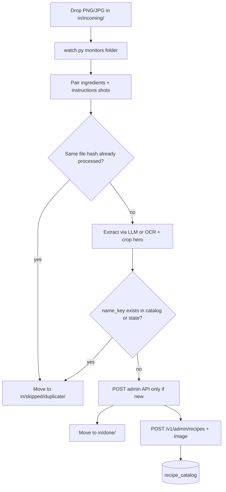
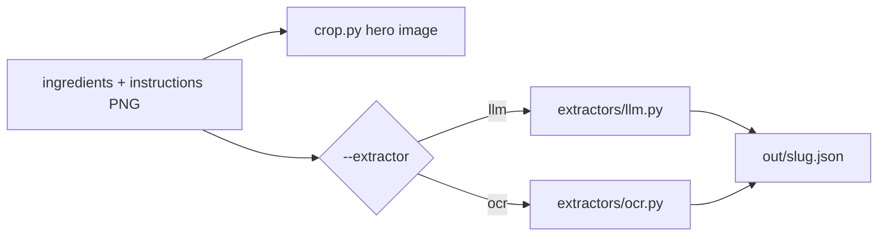

# Standalone Recipe Loader + Folder Watch (One-Time Ops)

## Design principle

**Not production code.** Dev/ops utility for one-time catalog bootstrap — same category as [`scripts/import_xlsm.py`](scripts/import_xlsm.py).

- Lives under **`scripts/recipe_loader/`**
- **Zero changes** to `backend/app/`, `apps/web/`, Docker, or deployed images
- **Folder watch** is the primary workflow: drop screenshots → auto-extract → auto-push via admin API
- Optional **`--no-push`** / **`--review`** flags for dry-run or pause-before-API



---

## Folder layout

```
scripts/recipe_loader/
├── watch.py            # Main entry: folder monitor + pipeline orchestration
├── extract.py          # Orchestrates crop + chosen extractor backend
├── load.py             # Admin API client (callable from watch)
├── crop.py             # Hero image crop (Pillow)
├── extractors/
│   ├── __init__.py     # get_extractor(name) factory
│   ├── base.py         # Extractor protocol + shared RecipeDraft type
│   ├── llm.py          # OpenAI vision (structured JSON)
│   └── ocr.py          # Tesseract + region/heuristic parsing
├── pairing.py          # Group screenshots into recipe jobs
├── state.py            # Job state / idempotency on disk
├── normalize.py        # name_key (matches backend)
├── requirements.txt    # core: pillow, httpx, watchdog, openai
├── requirements-ocr.txt  # optional: pytesseract (+ system tesseract-ocr)
├── in/
│   ├── incoming/       # Watch target — drop new files here
│   ├── processing/     # Files being worked on
│   ├── done/           # Successfully pushed (new recipe only)
│   ├── skipped/
│   │   └── duplicate/  # Already in catalog or re-dropped same files
│   └── failed/         # Extraction or API errors (+ error.txt)
├── out/                # Extracted JSON + cropped images (audit trail)
└── state/
    └── jobs.json       # Processed file hashes, job status
```

All of `in/`, `out/`, `state/` are **gitignored**.

---

## Watch workflow

### Start the watcher

```bash
cd scripts/recipe_loader
pip install -r requirements.txt
export OPENAI_API_KEY=...          # only when --extractor llm
export ADMIN_KEY=...
export API_URL=http://localhost:3000

python watch.py --extractor llm    # default: vision LLM
python watch.py --extractor ocr    # local Tesseract, no API cost
# options:
python watch.py --watch-dir in/incoming --debounce-ms 2000
python watch.py --no-push          # extract only, write out/*.json
python watch.py --review             # extract + write JSON, wait for manual load.py
python watch.py --poll               # use polling instead of watchdog (WSL-safe fallback)
```

Runs until Ctrl+C. Intended for a local terminal session during the one-time import — not a systemd service in production.

### Drop screenshots

**Naming convention (recommended)** — pairs files without extra metadata:

```
in/incoming/pumkin-aloo-tikki__ingredients.png
in/incoming/pumkin-aloo-tikki__instructions.png
```

- Shared prefix (`pumkin-aloo-tikki`) = job slug
- Suffix `__ingredients` | `__instructions` = tab type
- Slug maps to meal-plan `name` if you use meal-plan spelling in the prefix

**Alternative:** single file with both tabs visible (rare) — vision extracts all fields from one shot.

**Auto-pairing without strict names:** vision classifies each new file (`ingredients` | `instructions` | `unknown`) and groups by extracted recipe title. Slower and less reliable — naming convention is preferred.

### Pipeline per job

1. **Debounce** — wait until file size stable (~2s) so partial copies are ignored
2. **Pair** — when both `__ingredients` and `__instructions` exist for same slug (or `--pair-timeout 120` elapsed with only ingredients → push with empty instructions + log warning)
3. **Extract** — run selected backend (`llm` or `ocr`) on both images; crop hero from ingredients shot
4. **Write** — `out/{slug}.json` + `out/{slug}.jpg`
5. **Duplicate check** — see [Duplicate prevention](#duplicate-prevention); if duplicate, skip push entirely
6. **Push** (unless `--no-push` and not duplicate) — `load.py`: create recipe + upload image **only when `name_key` is new**
7. **Archive** — `in/done/{slug}/` on success; `in/skipped/duplicate/{slug}/` on duplicate
8. **State** — update `state/jobs.json` with status `pushed` | `skipped_duplicate` | `failed`

On failure: move to `in/failed/{slug}/` with `error.log`; do not retry automatically unless file is re-dropped with a **new** name or `--force` is used.

---

## Duplicate prevention

**Default: never create a second catalog entry for the same recipe.** The backend already enforces this via unique `name_key` ([`RecipeCatalogEntry.name_key`](backend/app/models.py)) and returns **409** on duplicate create ([`recipes.py`](backend/app/routers/recipes.py) L116–119). The utility checks **before** calling the API so duplicates are skipped quietly (no failed jobs, no wasted vision calls on re-drops).

### `name_key` (canonical identity)

Mirror backend [`normalize_meal_name`](backend/app/meals.py) in `scripts/recipe_loader/normalize.py`:

```python
def normalize_name_key(name: str) -> str:
    return re.sub(r"\s+", " ", name.strip().lower())
```

Examples — all resolve to the same key:

| `name` in JSON | `name_key` |
|----------------|------------|
| `Pumkin Aloo Tikki` | `pumkin aloo tikki` |
| `pumkin aloo tikki` | `pumkin aloo tikki` |
| `  Pumkin   Aloo  Tikki  ` | `pumkin aloo tikki` |

### Three-layer checks (in order)

| Layer | When | Action |
|-------|------|--------|
| **1. File hash** | Before extract | If SHA-256 of ingredient + instruction files already in `state/jobs.json` with status `pushed` or `skipped_duplicate` → skip job, archive to `skipped/duplicate/` |
| **2. Local `name_key`** | After extract, before push | If `name_key` in `state/catalog_keys.json` (cached from last successful push this session) or in `state/jobs.json` as `pushed` → skip push |
| **3. Live catalog** | Before push | `GET /v1/recipes` → normalize each `name` to `name_key`; if match → skip push (log: `already exists id=N`) |

On watcher **startup**, refresh catalog cache once from `GET /v1/recipes` into `state/catalog_keys.json`.

### Push behavior (`load.py`)

```python
def push_recipe(payload, *, force=False) -> LoadResult:
    name_key = normalize_name_key(payload["name"])
    if not force and catalog_has(name_key):
        return LoadResult(status="skipped_duplicate", name_key=name_key, ...)
    # POST /v1/admin/recipes — if 409, treat as skipped_duplicate (not failed)
    ...
```

- **No `--force` by default** — duplicates are skipped, not updated
- **`--force-update`** (explicit only) — `PATCH /v1/admin/recipes/{id}` + replace image for an existing `name_key` (use when fixing bad extraction, not for normal drops)

### `state/jobs.json` entry shape

```json
{
  "pumkin-aloo-tikki": {
    "status": "pushed",
    "name_key": "pumkin aloo tikki",
    "recipe_id": 12,
    "file_hashes": ["abc...", "def..."],
    "pushed_at": "2026-05-31T12:00:00Z"
  }
}
```

Re-dropping the same screenshots → `skipped_duplicate` without calling LLM/OCR or POST.

---

## Extraction backends (LLM vs OCR)

**Pluggable via `--extractor`** on `watch.py` and `extract.py`. Same output shape (`RecipeDraft` → `out/{slug}.json`); only the text-extraction path differs.



### `llm` (default)

| | |
|--|--|
| **Engine** | OpenAI GPT-4o (vision) — env `OPENAI_API_KEY`, optional `OPENAI_MODEL` |
| **Input** | Both screenshots as images in one structured prompt |
| **Output** | JSON: `name`, `display_name`, `ingredients[]`, `instructions` |
| **Pros** | Best accuracy on mobile UI, tabs, bullets; infers tab type if needed |
| **Cons** | API cost; requires network |

### `ocr`

| | |
|--|--|
| **Engine** | Tesseract via `pytesseract` — **system package required:** `tesseract-ocr` (apt) |
| **Input** | OCR full screenshot text; optional crop regions below tabs for ingredients vs instructions |
| **Parsing** | Heuristics: bullet/diamond lines → ingredients (`parse_ingredient_line` regex); numbered lines → instructions; title from top/header band |
| **Pros** | Free, offline, no API key |
| **Cons** | Weaker on UI chrome, fonts, and tab detection; may need manual JSON fixes in `out/` |

Install OCR extras:

```bash
pip install -r requirements.txt -r requirements-ocr.txt
sudo apt install tesseract-ocr   # WSL, one-time
```

### Config precedence

1. CLI: `--extractor llm|ocr`
2. Env: `RECIPE_EXTRACTOR=ocr`
3. Default: **`llm`**

Record extractor used in `out/{slug}.json`:

```json
"extractor": "llm"
```

### `manual` mode (no text extraction)

`--extractor manual` — crop hero image only; write scaffold JSON for hand-editing. No LLM, no Tesseract.

### Console output (example)

```
[pumkin-aloo-tikki] SKIP duplicate — catalog already has name_key "pumkin aloo tikki" (id=12)
```

vs successful:

```
[pumkin-aloo-tikki] PUSH ok — created id=15
```

---

## Target JSON (written before API push)

`out/{slug}.json`:

```json
{
  "name": "Pumkin Aloo Tikki",
  "display_name": "Pumpkin Aloo Tikki",
  "ingredients": [{ "amount": "1/2 cup", "item": "pumpkin (grated)" }],
  "instructions": "Step 1...",
  "image_file": "pumkin-aloo-tikki.jpg",
  "source_screenshots": ["pumkin-aloo-tikki__ingredients.png", "pumkin-aloo-tikki__instructions.png"]
}
```

`name` defaults from slug (hyphens → spaces, title case) unless extractor returns a better match to [`meal-plan.json`](public/data/meal-plan.json). Optional sidecar `in/incoming/{slug}.name` overrides catalog name exactly.

---

## API push (`load.py`)

**Only** talks to existing endpoints:

| Step | Endpoint | When |
|------|----------|------|
| List (cache) | `GET /v1/recipes` | Startup + before each push |
| Create | `POST /v1/admin/recipes` | Only if `name_key` not in catalog |
| Image | `POST /v1/admin/recipes/{id}/image` | Only after successful create |
| Update | `PATCH /v1/admin/recipes/{id}` | Only with `--force-update` |

- **Duplicates:** skip create + image upload; never treat 409 as a hard failure
- **Dry-run:** `watch.py --no-push` still writes `out/` and runs duplicate check (logs `would skip` / `would push`)

Uses `httpx` + env `ADMIN_KEY`, `API_URL` — no imports from `backend.app`.

---

## WSL / Windows notes

- Watch **`in/incoming/`** inside the WSL project path (`/home/.../DailyDiet/...`) so the daemon and API share the same filesystem
- If `watchdog` misses events (some WSL↔Windows mount setups), use **`watch.py --poll`** (scan every N seconds)
- Screenshots saved from phone → copy into WSL `in/incoming/` (not a Windows-only path outside WSL unless using `--poll` on that path)

---

## Screenshot content reminder

| Field | Source |
|-------|--------|
| Photo | Cropped from **ingredients** screenshot (top ~40%) |
| Ingredients | **ingredients** screenshot |
| Instructions | **instructions** screenshot (required for full auto-push unless `--allow-partial`) |

Meal-plan example: `"Pumkin Aloo Tikki\nCoriander Chutney"` — use slug `pumkin-aloo-tikki` and set `name` to match meal plan spelling.

---

## Modes summary

| Flag | Behavior |
|------|----------|
| `--extractor llm` | Vision LLM extraction (default) |
| `--extractor ocr` | Tesseract + heuristic parsing |
| `--extractor manual` | Crop only; empty JSON scaffold |
| (default) | Watch → extract → push → archive |
| `--no-push` | Watch → extract → `out/` only |
| `--review` | Same as `--no-push`; you run `load.py out/*.json` manually |
| `--allow-partial` | Push after ingredients-only if instructions never arrive |
| `--pair-timeout 120` | Seconds to wait for instructions file |
| `--poll` | Polling watcher instead of `watchdog` |
| `--force-update` | Overwrite existing catalog entry for same `name_key` (off by default) |

---

## Explicitly out of scope

- No production daemon, Docker service, or CI job
- No new backend routes or web UI import button
- No vision SDK in backend `requirements.txt`

---

## Manual CLIs (still available)

For one-off fixes without the watcher:

```bash
python extract.py --extractor ocr --slug pumkin-aloo-tikki --ingredients in/... --instructions in/...
python load.py out/pumkin-aloo-tikki.json
```

---

## Files touched (utility only)

| File | Action |
|------|--------|
| `scripts/recipe_loader/watch.py` | New — folder monitor + orchestration |
| `scripts/recipe_loader/pairing.py`, `state.py` | New |
| `scripts/recipe_loader/extractors/llm.py`, `ocr.py` | New — switchable backends |
| `scripts/recipe_loader/extract.py`, `load.py`, `crop.py` | New |
| `scripts/recipe_loader/requirements.txt` | New (`watchdog`, `pillow`, `httpx`, `openai`) |
| `scripts/recipe_loader/requirements-ocr.txt` | New (`pytesseract`) |
| `.gitignore` | `scripts/recipe_loader/in/`, `out/`, `state/` |
| `backend/app/`, `apps/web/` | **No changes** |
