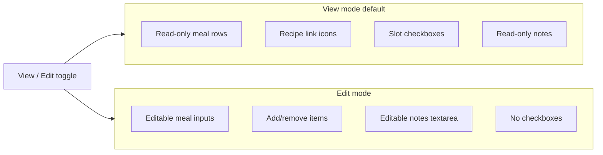

# View mode vs Edit mode

## Context

Today [`apps/web/src/App.tsx`](apps/web/src/App.tsx) always renders editable [`MealSlotEditor`](apps/web/src/MealSlotEditor.tsx) inputs and checkboxes together. The existing `viewMode` state is **layout** (week grid vs day view), not read/write — we will rename it to avoid confusion.

**Your choices:** default **View**; checkboxes **only in View mode**; Edit mode is for text/notes changes only.

No backend or API changes required.

---

## UX design



| Control | View mode | Edit mode |
|---------|-----------|-----------|
| Meal items | Text labels + recipe links | Inputs, add/remove rows |
| Completion checkbox | Shown | Hidden |
| Week notes | Read-only | Editable textarea |
| Reset week / Import JSON | Hidden | Shown in actions bar |
| Export JSON | Shown (both) | Shown (both) |
| Week grid / Day layout toggle | Shown (both) | Shown (both) |

Header toggle placement — next to existing layout toggle in `.controls`:

```
[ Week ▼ ]  [ Week grid | Day view ]  [ View | Edit ]
```

Persist preference in `localStorage` key `dailyDiet.interactionMode` (`"view"` | `"edit"`), default `"view"`.

---

## Implementation

### 1. Rename layout state in [`App.tsx`](apps/web/src/App.tsx)

- `ViewMode` → `LayoutMode` (`"week" | "day"`)
- `viewMode` / `setViewMode` → `layoutMode` / `setLayoutMode`
- Add `InteractionMode` type (`"view" | "edit"`) + state initialized from `localStorage`

### 2. New read-only component [`MealSlotViewer.tsx`](apps/web/src/MealSlotViewer.tsx)

Extract shared recipe-link row markup; viewer renders:

```
[↗] Paneer Patty/Puff
[↗] Mint Chutney
```

- Empty slot: show em dash or muted “—”
- Reuse `.meal-items`, `.meal-item-row`, `.recipe-link` classes from [`styles.css`](apps/web/src/styles.css)
- Add `.meal-item-text` for read-only label styling

Refactor [`MealSlotEditor.tsx`](apps/web/src/MealSlotEditor.tsx) to optionally import a small shared `RecipeLink` helper (inline is fine if minimal).

### 3. Wire modes in [`App.tsx`](apps/web/src/App.tsx)

Week grid + day view cells:

```tsx
{interactionMode === "view" ? (
  <>
    <input type="checkbox" ... />
    <MealSlotViewer items={...} />
  </>
) : (
  <MealSlotEditor items={...} onChange={...} />
)}
```

Notes section:

- View: `<p className="week-notes-readonly">` or `readOnly` textarea
- Edit: current debounced editable textarea

Actions bar — conditionally render:

- Always: Export JSON
- Edit only: Reset week, Reset tracking, Import JSON

### 4. CSS updates in [`styles.css`](apps/web/src/styles.css)

- `.meal-item-text` — no border, compact padding, wraps long names
- `.week-notes-readonly` — same box as textarea but no focus ring
- Optional `.main-edit-mode` on `<main>` for subtle visual cue (e.g. dashed border on grid)

### 5. Requirements doc

Add to [`docs/REQUIREMENTS.md`](docs/REQUIREMENTS.md):

| ID | Requirement |
|----|-------------|
| **FR-25** | **View mode** (default): read-only meal items, recipe links, slot checkboxes, read-only notes |
| **FR-26** | **Edit mode**: editable meals/notes; no checkboxes; destructive/import actions visible |

Update traceability matrix UI column.

---

## Files touched

| File | Change |
|------|--------|
| [`apps/web/src/App.tsx`](apps/web/src/App.tsx) | Toggle, mode wiring, rename layout state, conditional actions |
| [`apps/web/src/MealSlotViewer.tsx`](apps/web/src/MealSlotViewer.tsx) | New read-only component |
| [`apps/web/src/MealSlotEditor.tsx`](apps/web/src/MealSlotEditor.tsx) | Minor cleanup (optional shared link) |
| [`apps/web/src/styles.css`](apps/web/src/styles.css) | Read-only styles |
| [`docs/REQUIREMENTS.md`](docs/REQUIREMENTS.md) | FR-25, FR-26 |

---

## Verification

1. App opens in **View** — meals are text, checkboxes work, no inputs/add/remove buttons.
2. Switch to **Edit** — inputs appear, checkboxes disappear, notes editable, Reset/Import visible.
3. Toggle back to View — unsaved edit-mode changes already persisted via existing debounced PATCH.
4. Refresh page — last selected mode restored from `localStorage`.
5. Recipe links work in View mode only (still visible in Edit mode per current behavior).
