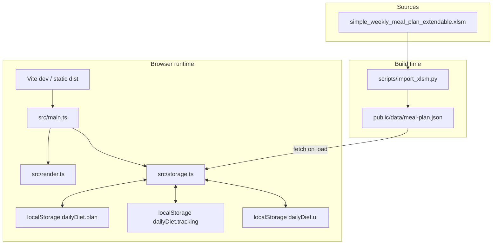

# DailyDiet

Weekly meal-plan tracker for the **Fitelo** diet routine. Displays an **8-slot × 7-day** grid per week, supports in-browser editing, checkbox tracking, and backup via JSON export/import.

| | |
|---|---|
| **Stack** | Vite 6, TypeScript (vanilla, no framework), static SPA |
| **Backend** | None — all persistence in `localStorage` |
| **Seed data** | `simple_weekly_meal_plan_extendable.xlsm` → `public/data/meal-plan.json` |
| **Dev URL** | http://localhost:5173 |
| **Primary workspace** | WSL: `/home/pingmepls/projects/DailyDiet` |

---

## Table of contents

1. [Overview](#overview)
2. [Architecture](#architecture)
3. [Project structure](#project-structure)
4. [Data model](#data-model)
5. [Persistence & data flow](#persistence--data-flow)
6. [Excel import pipeline](#excel-import-pipeline)
7. [Frontend modules](#frontend-modules)
8. [UI behaviour](#ui-behaviour)
9. [Development](#development)
10. [Build & deploy](#build--deploy)
11. [Known quirks](#known-quirks)
12. [Out of scope (v1)](#out-of-scope-v1)
13. [Agent handoff — keeping docs in sync](#agent-handoff--keeping-docs-in-sync)

---

## Overview

DailyDiet helps follow a structured diet with **8 meals per day** at fixed times (6:30 AM through 10:00 PM). Each **week block** in the spreadsheet maps to one selectable week in the app (Mon–Sun columns, 8 meal rows).

**User-facing capabilities**

- View weekly grid or single-day list (mobile-friendly)
- Edit meal text and week notes inline
- Mark meals done with checkboxes (cell background turns red)
- Highlight “today” column when the week has a parseable start date
- Reset a week to seed data, reset all checkboxes
- Export / import full backup JSON (plan + tracking)

---

## Architecture



**Design choices**

| Decision | Rationale |
|----------|-----------|
| Vanilla TS, no React | Small surface area; single page; minimal bundle (~10 KB JS) |
| Full re-render on state change | Simple event wiring; no virtual DOM library |
| Seed JSON + localStorage overlay | Excel is source of truth for initial data; user edits stay local |
| Stdlib Python importer | No pip dependency; `.xlsm` parsed as ZIP + XML |

---

## Project structure

```
DailyDiet/
├── index.html                 # SPA shell, loads src/main.ts
├── package.json               # npm scripts & devDependencies
├── tsconfig.json
├── vite.config.ts
├── .gitignore                 # node_modules/, dist/
├── README.md                  # This file — keep updated for agents
├── simple_weekly_meal_plan_extendable.xlsm   # Source meal plan (Excel)
├── public/
│   └── data/
│       └── meal-plan.json     # Generated seed (committed)
├── scripts/
│   ├── import_xlsm.py         # xlsm → JSON (stdlib only)
│   ├── setup_wsl.sh           # Optional WSL bootstrap helper
│   └── build.sh               # Optional build helper
└── src/
    ├── main.ts                # Boot, state, event handlers
    ├── render.ts              # DOM templates & listeners
    ├── storage.ts             # fetch seed, localStorage CRUD
    ├── types.ts               # Types, cellId, date helpers
    └── style.css              # Layout, grid, done/today styles
```

---

## Data model

### `MealPlan` (root)

```ts
type MealPlan = {
  timeSlots: TimeSlot[];   // 8 fixed slots, shared across weeks
  weeks: Week[];
};

type TimeSlot = { id: number; label: string; time: string };
// e.g. { id: 1, label: "Meal 1", time: "6:30 AM" }

type Week = {
  id: string;              // "week-1", "week-2", … (sequential by block order)
  title: string;           // "Week N starting: May 4, 2026"
  meals: Record<DayKey, string[]>;  // 8 strings per day; "" if empty
  notes: string;
};

type DayKey = "monday" | "tuesday" | … | "sunday";
```

### Tracking cell ID

Format: `{weekId}:{day}:{slotIndex}`  
Example: `week-2:wednesday:3` → Week 2, Wednesday, Meal 4 (0-based index 3).

### Export bundle

```ts
type ExportBundle = {
  plan: MealPlan;
  tracking: Record<string, boolean>;
  exportedAt: string;      // ISO timestamp
};
```

### Fixed meal times (default)

| Slot | Time |
|------|------|
| Meal 1 | 6:30 AM |
| Meal 2 | 8:00 AM |
| Meal 3 | 10:00 AM |
| Meal 4 | 1:00 PM |
| Meal 5 | 3:00 PM |
| Meal 6 | 6:00 PM |
| Meal 7 | 8:00 PM |
| Meal 8 | 10:00 PM |

Times may be overridden per import from column A labels in the spreadsheet.

---

## Persistence & data flow

### Load sequence (`initPlan`)

1. `fetch("/data/meal-plan.json")` → cache as **seed** in memory (`seedPlan`).
2. If `localStorage["dailyDiet.plan"]` exists → use it (user-edited plan).
3. Else → use seed clone.

Tracking and UI load independently from `dailyDiet.tracking` and `dailyDiet.ui`.

### localStorage keys

| Key | Content | Written when |
|-----|---------|--------------|
| `dailyDiet.plan` | Full `MealPlan` after first edit | Debounced 300 ms after meal/notes change |
| `dailyDiet.tracking` | `Record<cellId, boolean>` | Immediately on checkbox toggle |
| `dailyDiet.ui` | `{ selectedWeekId, viewMode, selectedDay }` | Week/view/day change |
| `dailyDiet.seed` | `{ version: number }` | Metadata on plan save (week count) |

### Seed vs localStorage

| Action | Affects seed JSON | Affects localStorage |
|--------|--------------------|--------------------|
| Run `import_xlsm.py` | Yes | No |
| Edit meal in app | No | Yes |
| Reset week | No | Yes (that week reverted to seed) |
| Export / Import JSON | No | Yes (on import) |

**Important:** After re-importing JSON, users with an old `dailyDiet.plan` may still see stale titles/meals until they reset weeks or clear `dailyDiet.plan`.

---

## Excel import pipeline

**Script:** `scripts/import_xlsm.py`  
**Input:** `simple_weekly_meal_plan_extendable.xlsm` (sheet1)  
**Output:** `public/data/meal-plan.json`

### Spreadsheet layout (repeating blocks)

```
Week N starting: <date>     ← block header (column A)
Meal | Mon | Tue | … Sun  ← day-name header row (skipped)
Meal 1 / 6:30AM | …       ← 8 meal rows
…
Meal 8 | …
Notes:                     ← optional notes row
```

### Import rules

1. Scan column A for `Week \d+ starting:` rows.
2. **Meal rows start at `header_row + 2`** (skip the day-name header).
3. Read columns B–H into `monday` … `sunday`; each day gets 8 strings.
4. **Week IDs** are sequential by block order: `week-1`, `week-2`, … (not always matching sheet week number labels).
5. **Missing start dates:** auto-filled for weeks **1–10** only, each +7 days from the previous known date (`AUTO_DATE_UNTIL_WEEK = 10` in script).
6. Uses Python stdlib only (`zipfile` + `xml.etree`); no openpyxl required.

### Commands

```bash
python3 scripts/import_xlsm.py
# or
npm run import:meals
```

### Current seed content (as of last import)

- **Weeks 1–5:** populated meals (Week 1 Wed–Sun only in original sheet)
- **Weeks 6–26:** empty template rows (editable in app)
- **Start dates:** Weeks 1–10 have dates; 11+ titles may lack dates

---

## Frontend modules

| Module | Responsibility |
|--------|----------------|
| `main.ts` | App state (`plan`, `tracking`, `ui`), handler implementations, debounced save, boot |
| `render.ts` | Builds HTML strings, attaches listeners, week grid + day view |
| `storage.ts` | Seed fetch, localStorage read/write, reset/export/import helpers |
| `types.ts` | Shared types, `cellId()`, `parseWeekStartDate()`, `todayDayKeyForWeek()` |
| `style.css` | CSS variables, responsive grid, `.cell-done` red background, `.col-today` highlight |

### Render model

- **No framework** — `renderApp()` sets `root.innerHTML` and re-binds listeners on each refresh.
- State mutations happen in handlers; `refresh()` re-renders the full UI.

### Handler summary (`AppHandlers`)

| Handler | Effect |
|---------|--------|
| `onWeekChange` | Switch selected week |
| `onViewModeChange` | `"week"` grid or `"day"` list |
| `onDayChange` | Day picker in day view |
| `onMealChange` | Update cell text, debounced save |
| `onNotesChange` | Update week notes, debounced save |
| `onTrackToggle` | Set/delete tracking key, save immediately |
| `onResetWeek` | Replace week from seed |
| `onResetTracking` | Clear all checkboxes |
| `onExport` | Download JSON backup |
| `onImport` | Restore from JSON file |

---

## UI behaviour

### Week grid (desktop)

- Sticky first column: slot label + time
- 7 day columns; each cell = checkbox + `<textarea>`
- **Done:** `.cell-done` → background `#fecaca` (red), no strikethrough
- **Today:** `.col-today` yellow highlight when week title date range includes today

### Day view (mobile)

- Vertical list of 8 slots for selected day
- Same checkbox + textarea + done styling

### Header actions

- Week `<select>`, view toggle, day picker (day mode)
- Reset week · Reset tracking · Export JSON · Import JSON

---

## Development

### Prerequisites

- **Node.js** LTS (via nvm recommended in WSL)
- **Python 3** (for import script only; stdlib sufficient)

### WSL setup (recommended)

```bash
cd ~/projects/DailyDiet

# Node (first time)
curl -fsSL https://raw.githubusercontent.com/nvm-sh/nvm/v0.40.1/install.sh | bash
source ~/.nvm/nvm.sh
nvm install --lts

npm install
npm run dev
```

Open http://localhost:5173

### npm scripts

| Script | Command | Purpose |
|--------|---------|---------|
| `dev` | `vite` | Dev server with HMR |
| `build` | `tsc && vite build` | Typecheck + production bundle → `dist/` |
| `preview` | `vite preview` | Serve production build locally |
| `import:meals` | `python scripts/import_xlsm.py` | Regenerate seed JSON from Excel |

### Typecheck

```bash
npx tsc --noEmit
```

---

## Build & deploy

```bash
npm run build
```

Output: `dist/` (static files). Deploy to any static host (GitHub Pages, Netlify, S3, etc.). Ensure `/data/meal-plan.json` is served from the same origin.

**Note:** `localStorage` is per-browser; deployed instances do not sync user data across devices unless export/import is used.

---

## Known quirks

| Topic | Detail |
|-------|--------|
| Excel week labels | Sheet may label two blocks “Week 2”; app uses sequential `week-N` ids |
| Week 1 meals | Original sheet only had Wed–Sun; Mon/Tue are blank |
| Excel typos preserved | e.g. “SAunf”, “Chamolmile” — fix in app or Excel then re-import |
| localStorage stale data | Re-import JSON does not auto-clear `dailyDiet.plan` |
| WSL + Windows git | Prefer git commands inside WSL native path (`/home/.../DailyDiet`) |
| Date auto-fill | Only weeks 1–10; change `AUTO_DATE_UNTIL_WEEK` in import script to extend |

---

## Out of scope (v1)

- Backend, accounts, multi-device sync
- Reading `.xlsm` in the browser
- Meal history, stats, charts
- Excel macros (ignored; cell values only)
- Automated tests (none yet)

---

## Agent handoff — keeping docs in sync

When changing this project, **update this README** in the same PR/commit if any of the following change:

| Change type | Update sections |
|-------------|-----------------|
| New file / module | [Project structure](#project-structure), [Frontend modules](#frontend-modules) |
| Data shape / localStorage keys | [Data model](#data-model), [Persistence](#persistence--data-flow) |
| Import logic / Excel layout | [Excel import pipeline](#excel-import-pipeline), [Known quirks](#known-quirks) |
| UI features / styling | [UI behaviour](#ui-behaviour), [Overview](#overview) |
| New npm scripts or deploy steps | [Development](#development), [Build & deploy](#build--deploy) |
| Scope change | [Out of scope](#out-of-scope-v1) |

### Suggested workflow for agents

1. Read this README first.
2. Run `npm install && npm run dev` (or `npm run build` to verify).
3. After Excel edits: `python3 scripts/import_xlsm.py` and commit `public/data/meal-plan.json`.
4. Keep types in `src/types.ts` as the source of truth for JSON shape.
5. Prefer small, focused diffs; match existing vanilla TS patterns (no new framework without discussion).
6. Update this file before marking work complete.

### Verification checklist

- [ ] `npm run build` passes
- [ ] Week grid shows 8 rows × 7 columns
- [ ] Checkbox marks cell red; persists after reload
- [ ] Meal edit persists after reload
- [ ] Export JSON contains `plan`, `tracking`, `exportedAt`
- [ ] Day view works on narrow viewport
- [ ] README reflects any behaviour changes

---

## License

Private project (`package.json`: `"private": true`). Add a license file if the repo becomes public.
