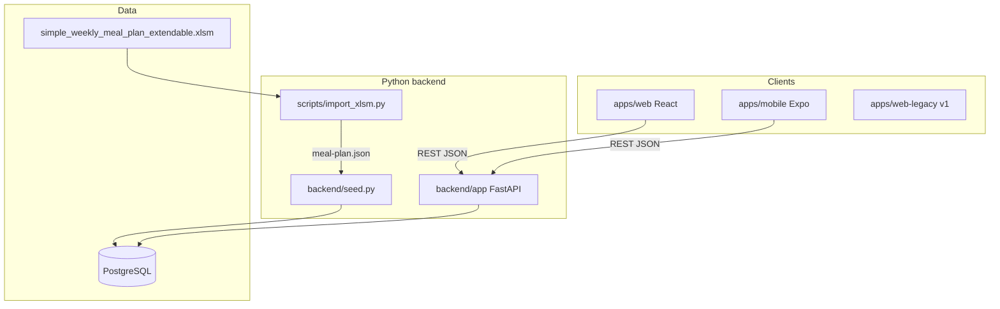
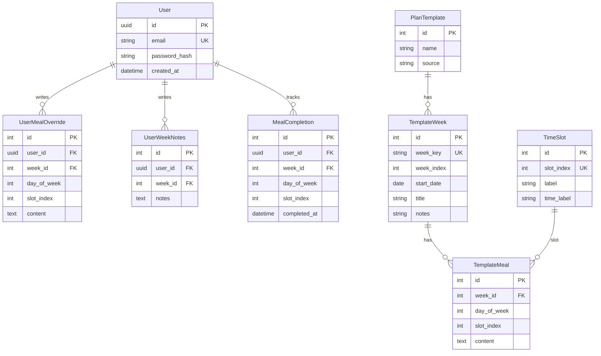

# DailyDiet v2 — Architecture

**Stack:** Python FastAPI · SQLAlchemy · Alembic · PostgreSQL · React (Vite) · Expo (Phase 3)

---

## System context



---

## Repository layout

```
DailyDiet/
├── backend/                 # Python API
│   ├── app/
│   │   ├── main.py          # FastAPI app, CORS, routers
│   │   ├── config.py        # Settings (DATABASE_URL, JWT)
│   │   ├── database.py      # SQLAlchemy session
│   │   ├── models.py        # ORM models
│   │   ├── schemas.py       # Pydantic DTOs
│   │   ├── auth.py          # JWT + password helpers
│   │   ├── deps.py          # get_db, get_current_user
│   │   └── routers/
│   ├── alembic/             # Migrations
│   ├── seed.py              # Load meal-plan.json → DB
│   └── requirements.txt
├── apps/
│   ├── web/                 # React + Vite (v2 client)
│   ├── web-legacy/          # v1 vanilla TS SPA
│   └── mobile/              # Expo scaffold
├── docs/
│   ├── REQUIREMENTS.md
│   └── ARCHITECTURE.md
├── scripts/import_xlsm.py
├── public/data/meal-plan.json
├── docker-compose.yml
└── README.md
```

---

## Database schema



**Merge rule:** API returns `template_meal.content` unless a `UserMealOverride` exists for that user/cell.

---

## REST API (v1)

| Method | Path | Auth | Description |
|--------|------|------|-------------|
| GET | `/health` | — | Liveness |
| GET | `/docs` | — | OpenAPI UI |
| GET | `/v1/time-slots` | optional | 8 slots |
| GET | `/v1/weeks` | optional | Week list |
| GET | `/v1/weeks/{week_key}` | optional | Week + merged meals |
| PATCH | `/v1/weeks/{week_key}/meals` | user | Upsert meal override |
| PATCH | `/v1/weeks/{week_key}/notes` | user | Upsert notes |
| POST | `/v1/weeks/{week_key}/reset` | user | Clear overrides for week |
| GET | `/v1/weeks/{week_key}/completions` | user | List completions |
| PUT | `/v1/weeks/{week_key}/completions` | user | Toggle completion |
| DELETE | `/v1/completions` | user | Clear all completions |
| GET | `/v1/export` | user | Export bundle JSON |
| POST | `/v1/import` | user | Import v1/v2 bundle |
| POST | `/v1/admin/seed` | admin key | Re-seed from JSON |
| POST | `/v1/auth/register` | — | Phase 2 |
| POST | `/v1/auth/login` | — | Phase 2 |
| POST | `/v1/auth/refresh` | refresh | Phase 2 |
| GET | `/v1/me` | user | Phase 2 |

Phase 1 without login: uses a **default dev user** when `Authorization` header absent (local dev only).

---

## Phased roadmap

| Phase | Deliverable |
|-------|-------------|
| **1** | FastAPI + Postgres + React web, feature parity with v1 |
| **2** | JWT auth, per-user data isolation |
| **3** | Expo mobile client |
| **4** | Stats, push reminders, offline sync (future) |

---

## Local development

```bash
docker compose up -d
cd backend && pip install -r requirements.txt
alembic upgrade head
python seed.py
uvicorn app.main:app --reload --port 3000

cd apps/web && npm install && npm run dev
```

---

## Security notes

- CORS restricted to web dev origin in config
- `ADMIN_API_KEY` protects seed endpoint
- JWT secret from environment in production
- Never commit `.env`
