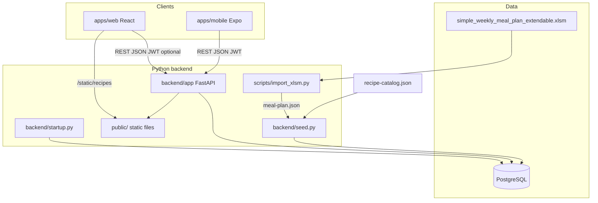
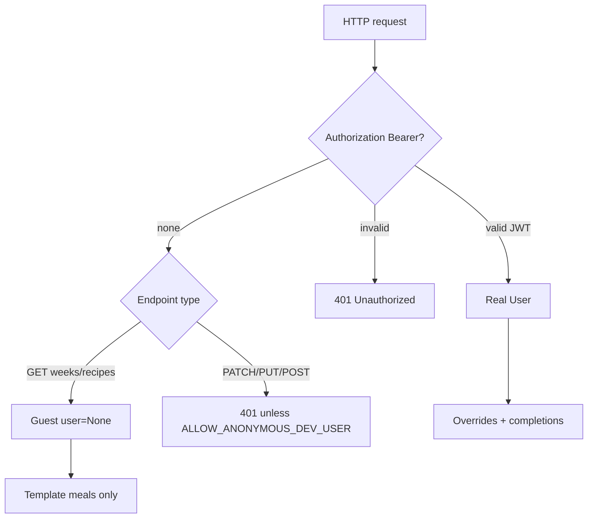
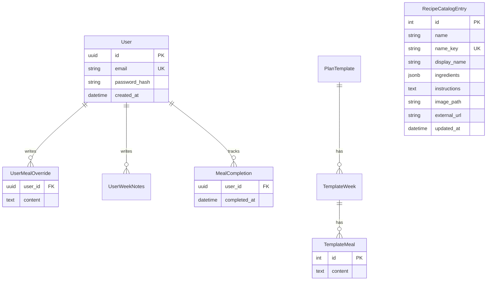

# DailyDiet v2 — Architecture

**Stack:** Python FastAPI · SQLAlchemy · PostgreSQL · React (Vite + React Router) · Expo (Phase 3)

---

## System context



---

## Repository layout

```
DailyDiet/
├── backend/
│   ├── app/
│   │   ├── main.py              # FastAPI, CORS, StaticFiles, routers
│   │   ├── config.py            # Settings (DB, JWT, ALLOW_ANONYMOUS_DEV_USER)
│   │   ├── database.py
│   │   ├── models.py            # ORM incl. RecipeCatalogEntry (rich schema)
│   │   ├── schemas.py           # Pydantic DTOs
│   │   ├── auth.py              # JWT + bcrypt
│   │   ├── deps.py              # get_optional_user, get_required_user, build_week_detail
│   │   ├── meals.py             # Meal item parse + catalog enrich
│   │   ├── recipe_utils.py      # Hybrid link resolution
│   │   └── routers/
│   │       ├── weeks.py
│   │       ├── recipes.py
│   │       └── auth.py
│   ├── startup.py               # create_all + migrate (container boot)
│   ├── init_db.py               # Full seed (destructive reset)
│   ├── migrate_recipe_catalog.py
│   └── seed.py
├── apps/web/src/
│   ├── main.tsx                 # BrowserRouter + AuthProvider
│   ├── App.tsx                  # Meal planner (home)
│   ├── auth.tsx                 # AuthProvider, useAuth
│   ├── api.ts                   # API client + token helpers
│   ├── components/AppHeader.tsx # Log in / Sign up (top right)
│   ├── RecipeCombobox.tsx       # Edit-mode meal item picker
│   ├── RecipeLink.tsx           # Hybrid internal/external link
│   ├── MealSlotEditor.tsx
│   ├── MealSlotViewer.tsx
│   └── pages/
│       ├── LoginPage.tsx        # /login
│       ├── RecipeListPage.tsx   # /recipes
│       ├── RecipeViewPage.tsx   # /recipes/:id
│       └── RecipeEditPage.tsx   # /recipes/new, /recipes/:id/edit
├── public/
│   ├── data/meal-plan.json
│   ├── data/recipe-catalog.json # Seed input only
│   └── recipes/                 # Uploaded recipe images (served at /static/recipes/)
├── docs/
│   ├── REQUIREMENTS.md
│   └── ARCHITECTURE.md
├── docker-compose.yml           # postgres + api (no web container)
└── README.md
```

**Web client** runs via `npm run dev` (port 5173), not Docker. Vite proxies `/v1` and `/static` to the API.

---

## Web routes

| Path | Page | Auth |
|------|------|------|
| `/` | Meal planner (Today / Week / Day) | Guest read-only; full features when logged in |
| `/login` | Login / register | Public |
| `/recipes` | Recipe list (admin CRUD) | Admin key in UI |
| `/recipes/new` | Create recipe | Admin key |
| `/recipes/:id` | Recipe view (photo, ingredients, steps) | Public |
| `/recipes/:id/edit` | Edit recipe + image upload | Admin key |

---

## Authentication model



| Dependency | Behavior |
|------------|----------|
| `get_optional_user` | JWT → user; no token → `None` (template-only reads) |
| `get_required_user` | JWT required → user; else **401** |
| `ALLOW_ANONYMOUS_DEV_USER=true` | Optional escape hatch: no token → shared dev user |

**Default (production-like):** guests browse template plan; mutations require login.

---

## Database schema



**Meal merge rule:** `template_meal.content` unless `UserMealOverride` exists for that user/cell. Slot text is split on newlines into **meal items**; each item is enriched from `recipe_catalog` by normalized `name_key`.

**Guest merge rule:** When `user is None`, only template meals and template notes are returned; completions list is empty.

---

## Recipe catalog & hybrid links

Lookup key: `normalize_meal_name(text)` — lowercase, trim, collapse whitespace.

| Recipe has | Meal icon links to |
|------------|-------------------|
| ingredients, instructions, or image | `/recipes/:id` (same tab) |
| only `external_url` | External URL (new tab) |
| neither | No icon |

Admin manages recipes at `/recipes` (web) or `/v1/admin/recipes` (API + `X-Admin-Key`). Images uploaded to `public/recipes/` via `POST /v1/admin/recipes/{id}/image`, served at `/static/recipes/{id}.jpg`.

---

## REST API (v1)

| Method | Path | Auth | Description |
|--------|------|------|-------------|
| GET | `/health` | — | Liveness |
| GET | `/docs` | — | OpenAPI UI |
| GET | `/static/*` | — | Public assets (recipe images) |
| GET | `/v1/time-slots` | — | 8 slots |
| GET | `/v1/weeks` | — | Week list |
| GET | `/v1/weeks/{week_key}` | optional user | Week detail; guest = template only |
| GET | `/v1/weeks/{week_key}/completions` | optional user | `[]` if guest |
| GET | `/v1/recipes` | — | Recipe list summary |
| GET | `/v1/recipes/{id}` | — | Full recipe detail |
| GET | `/v1/me` | required | Current user profile |
| PATCH | `/v1/weeks/{week_key}/meals` | required | Upsert meal override |
| PATCH | `/v1/weeks/{week_key}/notes` | required | Upsert notes |
| POST | `/v1/weeks/{week_key}/reset` | required | Clear overrides for week |
| PUT | `/v1/weeks/{week_key}/completions` | required | Toggle completion |
| DELETE | `/v1/completions` | required | Clear all completions |
| GET | `/v1/export` | required | Export bundle JSON |
| POST | `/v1/import` | required | Import v1/v2 bundle |
| POST | `/v1/auth/register` | — | Create account + tokens |
| POST | `/v1/auth/login` | — | Login + tokens |
| POST | `/v1/auth/refresh` | refresh body | New tokens |
| POST | `/v1/admin/seed` | admin key | Re-seed from JSON |
| POST | `/v1/admin/recipes` | admin key | Create recipe |
| PATCH | `/v1/admin/recipes/{id}` | admin key | Update recipe |
| DELETE | `/v1/admin/recipes/{id}` | admin key | Delete recipe |
| POST | `/v1/admin/recipes/{id}/image` | admin key | Upload recipe image |

---

## Web UI interaction modes

| Mode | Who | Behavior |
|------|-----|----------|
| **Guest** | Not logged in | View template plan; no Edit toggle, checkboxes, import/export, or saves |
| **View** | Logged in | Read-only meals + checkboxes + recipe links |
| **Edit** | Logged in | Editable meals (recipe combobox), notes, reset/import, Recipes admin link |

Header top row: **DailyDiet** (left) · **Log in / Sign up** or **email + Log out** (right). Guest banner on home when not authenticated.

### Recipe combobox (Edit mode)

`RecipeCombobox` on each meal item row:

- Dropdown of catalog recipes (by `display_name` or `name`)
- Free-text custom meal name still allowed
- Unmatched text → **Create recipe** link to `/recipes/new?name=…`
- Wired through `MealSlotEditor` → `DayMealsView` / week grid

---

## Local development

```bash
# Terminal 1 — DB + API
docker compose up -d
# backend/ is volume-mounted into the api container (live code without rebuild)
# or local venv:
cd backend && python startup.py && uvicorn app.main:app --reload --port 3000

# Terminal 2 — Web (no Docker image)
cd apps/web && npm install && npm run dev
```

- API: http://localhost:3000/docs  
- Web: http://localhost:5173  

**First-time DB:** `docker compose exec api python init_db.py` (full seed)  
**Schema only:** `python startup.py` or `python migrate_recipe_catalog.py`

**Optional:** `ALLOW_ANONYMOUS_DEV_USER=true` in `.env` restores legacy shared dev-user when no JWT.

---

## Phased roadmap

| Phase | Deliverable | Status |
|-------|-------------|--------|
| **1** | FastAPI + Postgres + React web | Done |
| **2** | JWT auth, guest mode, per-user isolation | Done (web) |
| **3** | Expo mobile client | Scaffold |
| **4** | Stats, push, offline sync | Future |

---

## Security notes

- CORS restricted to configured origins (`localhost:5173`, etc.)
- `ADMIN_API_KEY` protects seed and recipe admin endpoints
- JWT secret from environment in production
- Guest users cannot mutate data (401 on PATCH/PUT without token)
- Never commit `.env`

---

## Agent handoff — keeping docs in sync

When adding features, update these files together:

| Change type | Update |
|-------------|--------|
| New FR / behavior | `docs/REQUIREMENTS.md` — add FR row, traceability row, revision history |
| API / auth / routes | `docs/ARCHITECTURE.md` — REST table, web routes, diagrams |
| Dev setup / quick start | `README.md` |
| Session progress / where you left off | `docs/work_in_progress.md` |
| Mobile-only | `apps/mobile/README.md` |

**Current version:** REQUIREMENTS 2.6 (FR-01–37). Key v2.6 additions: rich recipes (FR-30–34), recipe combobox (FR-35), auth page + guest mode (FR-36–37).
