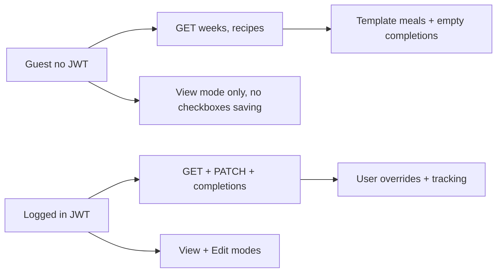

# Auth page + read-only guest mode

## Recommended approach (your choice: read-only guest)

Anonymous users see the **shared template meal plan** (no personal overrides, no saved checkboxes). **Login unlocks** edits, completions, import/export, reset, and Edit mode.

This is better than a hard login wall because users can preview the app before registering, while fixing today’s problem: every anonymous visitor silently acts as the shared `dev@dailydiet.local` user (`[get_or_create_dev_user](backend/app/deps.py)`).




---

## Backend changes

### 1. Split auth dependencies in `[backend/app/deps.py](backend/app/deps.py)`

- `**get_optional_user**` — returns `User | None`
  - Valid JWT → user
  - No/invalid JWT → `None` (no dev-user fallback by default)
- `**get_required_user**` — returns `User` or **401**
  - Used on all mutating endpoints

Add config in `[backend/app/config.py](backend/app/config.py)`:

```python
allow_anonymous_dev_user: bool = False  # set True in .env for old local-dev behavior
```

When `allow_anonymous_dev_user=True` and no token, fall back to `get_or_create_dev_user` (optional escape hatch for Docker dev).

### 2. Template-only week detail

Update `[build_week_detail()](backend/app/deps.py)` to accept `user: User | None`:

- `user is None` → skip override/notes queries; use template meals + template notes only

### 3. Route auth matrix in `[backend/app/routers/weeks.py](backend/app/routers/weeks.py)`


| Endpoint                                                                        | Auth                                                |
| ------------------------------------------------------------------------------- | --------------------------------------------------- |
| `GET /weeks`, `GET /weeks/:id`, `GET /time-slots`, `GET /weeks/:id/completions` | `get_optional_user` (completions → `[]` if no user) |
| `GET /me`                                                                       | `get_required_user`                                 |
| `PATCH` meals/notes, `PUT` completions, reset, import, export, clear            | `get_required_user`                                 |


Recipes stay public for read; admin recipe CRUD unchanged (`X-Admin-Key`).

---

## Frontend changes

### 4. Auth state — `[apps/web/src/auth.tsx](apps/web/src/auth.tsx)` (new)

- `AuthProvider` + `useAuth()` hook
- `isLoggedIn` from `getToken()` + optional `api.me()` on mount
- `login()`, `register()`, `logout()` wrapping `[api.ts](apps/web/src/api.ts)` token helpers
- On logout: `clearTokens()`, redirect to `/`

### 5. Login page — `[apps/web/src/pages/LoginPage.tsx](apps/web/src/pages/LoginPage.tsx)` (new)

- Email + password form
- **Log in** and **Create account** actions (single page, two buttons or tabs)
- On success: store tokens, redirect to `/` (or `?return=` path)
- Link back to meal plan for guests

Route in `[main.tsx](apps/web/src/main.tsx)`:

```tsx
<Route path="/login" element={<LoginPage />} />
```

Wrap app in `<AuthProvider>` inside `BrowserRouter`.

### 6. Shared header — `[apps/web/src/components/AppHeader.tsx](apps/web/src/components/AppHeader.tsx)` (new)

Top-right auth area:

- **Guest:** `Log in` (link `/login`) + `Sign up` (link `/login?mode=register`)
- **Logged in:** user email (from `/v1/me`) + `Log out` button

Use on:

- `[App.tsx](apps/web/src/App.tsx)` — replace inline auth panel
- `[RecipePageShell.tsx](apps/web/src/pages/RecipePageShell.tsx)` — consistent nav on recipe pages

Remove `[auth-panel](apps/web/src/App.tsx)` block entirely.

### 7. Guest UX in `[App.tsx](apps/web/src/App.tsx)`

When `!isLoggedIn`:

- Force **View** mode (hide Edit toggle, or show disabled with tooltip “Sign in to edit”)
- Hide checkboxes **or** show disabled with same hint (cleanest: hide checkboxes + hide progress that implies saving)
- Hide: Reset week, Reset tracking, Import, Recipes admin link (edit), debounced save paths
- Keep: week grid/day/today layouts, recipe **view** links (↗), Export optional (recommend hide export for guests too — contains personal data when logged in; for guests export is template-only → OK to hide or allow read-only export)
- Show subtle banner: “Browsing template plan — [Sign in]((/login)) to save your meals and tracking”

When logged in: current behavior unchanged.

### 8. API client — `[apps/web/src/api.ts](apps/web/src/api.ts)`

- Add `me: () => apiFetch<User>("/v1/me")` (typed)
- On **401** from mutation calls: optional `onUnauthorized` callback → navigate to `/login`

---

## Docs

Add **FR-36–37** to `[docs/REQUIREMENTS.md](docs/REQUIREMENTS.md)`:

- FR-36: Login/register on dedicated `/login` page; header auth control
- FR-37: Guest read-only template browse; authenticated users get personal overrides and tracking

---

## Local dev note

Document in `[README.md](README.md)`:

- Default: anonymous = guest (read-only)
- Optional: `ALLOW_ANONYMOUS_DEV_USER=true` restores old shared dev-user behavior for quick testing

---

## Implementation order

1. Backend: optional/required user deps + `build_week_detail(user=None)` + weeks router auth split
2. Frontend: `auth.tsx`, `LoginPage`, `AppHeader`
3. Wire `App.tsx` guest gating + remove auth panel
4. Recipe pages header + requirements/README

## Smoke test

- Open `/` logged out → see template plan, no Edit mode, no saved checkboxes
- Open `/login` → register → redirect home → Edit mode + checkboxes work
- Log out → back to read-only template (not dev user’s edits)
- Two different users → different meal overrides after login

