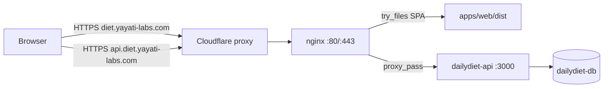

# DailyDiet — DigitalOcean droplet deployment

Production runbook for hosting DailyDiet on an Ubuntu droplet, with nginx as the public edge and optional Cloudflare DNS/proxy.

Canonical app path on the droplet: **`/opt/apps/DailyDiet`**. Repo templates in `deploy/` still use `YOUR_USER` placeholders — replace them with this path (and a non-root user if you are not running as `root`).

| Public host | Role |
|-------------|------|
| `https://diet.yayati-labs.com` | React SPA (`apps/web/dist`) |
| `https://api.diet.yayati-labs.com` | FastAPI via nginx → `127.0.0.1:3000` |

Related files:

- [`docker-compose.prod.yml`](../docker-compose.prod.yml) — Postgres + API
- [`.env.prod.example`](../.env.prod.example) — secrets template (copy to `.env.prod`, never commit)
- [`deploy/nginx/dailydiet.conf`](../deploy/nginx/dailydiet.conf) — HTTP vhosts
- [`deploy/systemd/dailydiet.service`](../deploy/systemd/dailydiet.service) — start Compose on boot
- [`deploy/README.md`](../deploy/README.md) — short command cheat sheet
- [`scripts/diagnose_cf521.sh`](../scripts/diagnose_cf521.sh) — Cloudflare 521 origin diagnostics (run on droplet)

See also **§12** for migrating weekly plan + recipe catalog (not users) from local to the droplet.

---

## 1. High-level architecture

The web client is **not** in Docker. Compose runs Postgres and the API only. nginx serves the built SPA and reverse-proxies the API. Browsers never talk to port `3000`.

```
                    Internet
                        |
                        v
              +-------------------+
              | Cloudflare (opt.) |
              | DNS + orange cloud|
              | SSL/TLS Full strict|
              +-------------------+
                        |
                   80 / 443
                        |
                        v
              +-------------------+
              | Ubuntu droplet    |
              | nginx             |
              |  diet.*  → static |
              |  api.*   → :3000  |
              +---------+---------+
                        |
              127.0.0.1:3000
                        |
              +---------v---------+
              | Docker Compose    |
              |                   |
              |  dailydiet-api    |---- TCP ----+
              |  (FastAPI :3000)  |             |
              |                   |             v
              |  dailydiet-db     |      postgres:5432
              |  (Postgres 16)    |      (docker network only)
              +-------------------+
```



### Trust boundaries

| Surface | Binding | Public? |
|---------|---------|---------|
| nginx HTTP/HTTPS | `0.0.0.0:80` and `:443` | Yes (Cloudflare and/or internet) |
| FastAPI | `127.0.0.1:3000` only | No |
| Postgres | Docker network `dailydiet_default`, no host port | No |

### Request flow

1. Browser loads `https://diet.yayati-labs.com` → nginx serves `apps/web/dist` (`try_files` → `index.html` for client routes).
2. SPA calls `https://api.diet.yayati-labs.com/...` because `VITE_API_BASE_URL` was set at **build** time.
3. nginx proxies that host to `http://127.0.0.1:3000`.
4. API uses `DATABASE_URL` host **`postgres`** (Compose service name) on the Docker network, not localhost and not a Unix socket.
5. Recipe images live in `public/recipes` (bind-mounted into the API container) and are served as `/static/...` on the API host.

### What does *not* run in production

- `npm run dev` / Vite `:5173` — local only.
- `docker compose up` (dev compose) — publishes `3000` and `5432` on all interfaces; use **`docker-compose.prod.yml`**.
- `ALLOW_ANONYMOUS_DEV_USER=true`.

---

## 2. Prerequisites

- DigitalOcean Ubuntu 24.04 droplet (2 GB RAM recommended).
- SSH access (this runbook uses `root`; a sudo user in group `docker` is better).
- Domain on Cloudflare (or any DNS) with nameservers delegated.
- Docker Engine + Compose plugin.
- Node.js for the web build (nvm is fine: `export PATH="$HOME/.nvm/versions/node/v24.16.0/bin:$PATH"`).
- Firewall: **22, 80, 443** only. Do not publish **3000** or **5432**.

Install Docker (once), then clone:

```bash
# Docker: follow https://docs.docker.com/engine/install/ubuntu/
sudo usermod -aG docker "$USER"   # if not root; then re-login

sudo mkdir -p /opt/apps
sudo git clone <YOUR_REPO_URL> /opt/apps/DailyDiet
# or: git pull inside /opt/apps/DailyDiet if already cloned
cd /opt/apps/DailyDiet
```

---

## 3. DNS (Cloudflare)

Create **A** records to the droplet IPv4:

| Name | Type | Content | Proxy |
|------|------|---------|--------|
| `diet` | A | droplet IPv4 | Proxied (orange) after TLS works — OK with Universal SSL |
| `api.diet` | A | droplet IPv4 | **DNS only (grey)** recommended — see nested-subdomain note below |

**Orange vs grey cloud**

| Icon | Mode | Meaning |
|------|------|--------|
| Orange | Proxied | Browser → Cloudflare (TLS at CF) → origin |
| Grey | DNS only | Browser → droplet directly (TLS = Let's Encrypt on nginx) |

**Nested subdomain + Universal SSL:** Cloudflare free Universal SSL covers `*.yayati-labs.com` (e.g. `diet.yayati-labs.com`) but **not** `api.diet.yayati-labs.com` (a name under `diet.…`). If `api.diet` is **orange**, the SPA can load while API calls fail with browser **`ERR_SSL_VERSION_OR_CIPHER_MISMATCH`** / **Failed to fetch**.

**Recommended:** keep `api.diet` **grey (DNS only)** so clients use the origin Certbot cert (which includes both names). Keep `diet` orange if you want CF in front of the SPA.

**Alternatives if you need `api.diet` proxied:** Cloudflare Advanced Certificate (or similar) for `api.diet.yayati-labs.com` / `*.diet.yayati-labs.com`, **or** rename the API to a single-level host (e.g. `diet-api.yayati-labs.com`), update nginx + Certbot, and rebuild the web app with the new `VITE_API_BASE_URL`.

**SSL/TLS → Overview:** **Full (strict)** once origin has a valid certificate (relevant when a name is orange). Do not use Flexible long-term.

Grey-cloud both names **while issuing Let's Encrypt certificates**. HTTP-01 fails if the records are orange-clouded.

---

## 4. Secrets

```bash
cd /opt/apps/DailyDiet
cp .env.prod.example .env.prod
nano .env.prod
```

Set:

| Variable | Notes |
|----------|--------|
| `POSTGRES_PASSWORD` | Letters, numbers, `-`, `_` only. Avoid `@ # : / %` — they break `DATABASE_URL` interpolation. |
| `JWT_SECRET` | Long random string; not the local/dev secret. |
| `ADMIN_API_KEY` | Header `X-Admin-Key` for seed and recipe admin. |
| `CORS_ORIGINS` | Exactly `https://diet.yayati-labs.com` (no trailing slash). |
| `ALLOW_ANONYMOUS_DEV_USER` | `false` |

`--env-file .env.prod` on the Compose **CLI** is required so `${POSTGRES_PASSWORD}` interpolates in `docker-compose.prod.yml`. The `env_file:` on the `api` service does not do that interpolation by itself.

Do not commit `.env.prod`.

---

## 5. Start API + database

```bash
cd /opt/apps/DailyDiet
docker compose -f docker-compose.prod.yml --env-file .env.prod up -d --build
docker compose -f docker-compose.prod.yml --env-file .env.prod ps
curl -sS http://127.0.0.1:3000/health
# expect: {"status":"ok"}
```

`curl http://127.0.0.1:3000/health` only works **on the droplet**. Prod binds `127.0.0.1:3000`, not the public interface.

### First-time seed

Use a **single line** (broken `\` pastes cause `Invalid HTTP request received`):

```bash
cd /opt/apps/DailyDiet
KEY=$(grep '^ADMIN_API_KEY=' .env.prod | cut -d= -f2 | tr -d '\r')
curl -sS -X POST http://127.0.0.1:3000/v1/admin/seed -H "X-Admin-Key: $KEY"
```

Expect `{"ok": true, "message": "Database seeded from meal-plan.json and recipe-catalog.json"}`.

`startup.py` (container boot) creates/migrates tables only. Seed loads meal plan + recipe catalog.

### If the API is `Restarting`

```bash
docker logs dailydiet-api --tail 120
```

Common failures:

| Log | Cause | Fix |
|-----|--------|-----|
| `socket "@postgres/.s.PGSQL.5432"` | Malformed `DATABASE_URL` (Unix socket, not TCP) | Recreate API with `--env-file .env.prod`; simple password; URL must be `...@postgres:5432/dailydiet` |
| `password authentication failed for user "dailydiet"` | Volume was initialized with a different password | Empty DB only: `down`, `docker volume rm` the `dailydiet_pg` volume, `up` again. **Destroys data.** |
| `required variable POSTGRES_PASSWORD is missing` | Compose started without `--env-file .env.prod` | Always pass `--env-file .env.prod` |
| API `IPAddress` empty in `docker inspect` | Crash loop; not a separate network bug | Fix the crash; DB should already be on `dailydiet_default` as `172.18.0.x` |

Postgres image **ignores `POSTGRES_PASSWORD` after the first volume init**. Changing `.env.prod` and recreating only `api` does not change the DB password.

---

## 6. Build the web app

There is no Node daemon in production. Build static files; nginx serves `dist`.

```bash
export PATH="$HOME/.nvm/versions/node/v24.16.0/bin:$PATH"   # if using nvm
cd /opt/apps/DailyDiet/apps/web
npm install
VITE_API_BASE_URL=https://api.diet.yayati-labs.com npm run build
ls dist/index.html
```

`VITE_*` is compiled into the JS bundle. Changing the API host requires a rebuild. Leave `VITE_API_BASE_URL` unset for local `npm run dev` (Vite proxy).

---

## 7. nginx

```bash
sudo apt install -y nginx
sudo cp /opt/apps/DailyDiet/deploy/nginx/dailydiet.conf /etc/nginx/sites-available/dailydiet
sudo nano /etc/nginx/sites-available/dailydiet
```

Set **`root /opt/apps/DailyDiet/apps/web/dist;`** in the web server block. Do not leave `/home/YOUR_USER/...`.

Target HTTP config (Certbot later adds `listen 443 ssl` and redirects):

```nginx
# --- Web SPA ---
server {
    listen 80;
    listen [::]:80;
    server_name diet.yayati-labs.com;

    root /opt/apps/DailyDiet/apps/web/dist;
    index index.html;

    location / {
        try_files $uri $uri/ /index.html;
    }
}

# --- API ---
server {
    listen 80;
    listen [::]:80;
    server_name api.diet.yayati-labs.com;

    client_max_body_size 6m;

    location / {
        proxy_pass http://127.0.0.1:3000;
        proxy_http_version 1.1;
        proxy_set_header Host $host;
        proxy_set_header X-Real-IP $remote_addr;
        proxy_set_header X-Forwarded-For $proxy_add_x_forwarded_for;
        proxy_set_header X-Forwarded-Proto $scheme;
    }
}
```

Enable the site, disable the Ubuntu default:

```bash
sudo ln -sf /etc/nginx/sites-available/dailydiet /etc/nginx/sites-enabled/dailydiet
sudo rm -f /etc/nginx/sites-enabled/default
sudo nginx -t && sudo systemctl reload nginx
```

`unknown directive "wq!"` means a vim `:wq!` was typed into the file. Delete that line. In **nano**: Ctrl+O, Enter, Ctrl+X.

### Firewall

```bash
sudo ufw allow OpenSSH
sudo ufw allow 'Nginx Full'    # 80 + 443
sudo ufw enable
sudo ufw status
```

Also open **22, 80, 443** on the DigitalOcean **cloud** firewall (separate from `ufw`). Do not leave Vite `5173` open.

### nginx smoke test (on the droplet)

```bash
ss -tlnp | grep -E ':80|:443|:3000'
curl -sS -H "Host: api.diet.yayati-labs.com" http://127.0.0.1/health
curl -sS -H "Host: diet.yayati-labs.com" http://127.0.0.1/ | head
```

Expect `{"status":"ok"}` and HTML containing `id="root"` (not `Welcome to nginx`).

| Result | Meaning |
|--------|---------|
| `/health` → nginx **404** | API `server_name` block missing or `default` still enabled; request never reached `:3000` |
| `/` → 615-byte welcome page | Wrong `root` or default site |
| `/` → **301** and no `:443` | HTTP→HTTPS redirect before Certbot; origin TLS not up yet |

---

## 8. HTTPS (Certbot + Cloudflare)

Cloudflare **521 Web server is down** means CF reached the droplet IP and the origin **refused the connection**. Common causes (often both):

1. SSL mode **Full / Full (strict)** while nginx listens on **:80 only** (`ss` shows no `:443`).
2. **`ufw` allows OpenSSH only** — ports 80/443 never opened (see §7 firewall).

### Diagnose 521 (on the droplet)

```bash
cd /opt/apps/DailyDiet
# If the script was edited on Windows, strip CRLF first:
#   sed -i 's/\r$//' scripts/diagnose_cf521.sh
bash scripts/diagnose_cf521.sh
sudo ufw status verbose
```

The script emits NDJSON for: nginx active + listeners, counts of `:80`/`:443`, ufw rules, `nginx -t` / `sites-enabled`, local `Host:` HTTP probe, and API `:3000/health`.

| Finding | Meaning | Fix |
|---------|---------|-----|
| `nginx` not `active` / nothing on `:80` | Edge not running | `sudo systemctl start nginx` and re-check site config |
| `count443`: **0** with CF Full/strict | Origin TLS missing → classic **521** | Certbot (§8 steps below), then `ss` shows `:443` |
| ufw **OpenSSH only** (no 80/443 / Nginx Full) | Public traffic dropped | `sudo ufw allow 80/tcp && sudo ufw allow 443/tcp` (or `sudo ufw allow 'Nginx Full'`) |
| Local Host curl **200** + SPA HTML, API `{"status":"ok"}` | App stack is fine; problem is CF↔origin path | Fix TLS and/or firewall, not `npm run build` |
| Local Host curl **301** after Certbot | Expected HTTP→HTTPS redirect | Probe `https://127.0.0.1/` or rely on CF once `:443` + ufw are open |

Also confirm DigitalOcean **cloud** firewall allows **22, 80, 443**.

### Issue certificates

1. Grey-cloud `diet` and `api.diet` in Cloudflare (easier while issuing).
2. Open firewall if needed, then:

```bash
sudo ufw allow 'Nginx Full'    # 80 + 443 — required for CF and Certbot HTTP-01
sudo apt install -y certbot python3-certbot-nginx
sudo certbot --nginx -d diet.yayati-labs.com -d api.diet.yayati-labs.com
sudo nginx -t && sudo systemctl reload nginx
ss -tlnp | grep -E ':80|:443'
bash scripts/diagnose_cf521.sh
```

Expect `count443` &gt; 0 and ufw listing Nginx Full or 80/443.

3. Cloudflare SSL/TLS → **Full (strict)** (for any **orange** records).
4. Proxy status: leave **`diet` orange** if desired; leave **`api.diet` grey (DNS only)** unless you have an Advanced Certificate covering that nested name (§3). Do **not** orange-cloud `api.diet` on Universal SSL alone.
5. Optional: Always Use HTTPS on.
6. Browser checks:
   - `https://api.diet.yayati-labs.com/health` → `{"status":"ok"}` (no SSL error)
   - `https://diet.yayati-labs.com/` → SPA loads; Network tab calls the API host successfully

### SPA loads but API Failed to fetch / SSL cipher mismatch

Symptom: UI at `diet.yayati-labs.com` works; console shows  
`GET https://api.diet.yayati-labs.com/v1/... net::ERR_SSL_VERSION_OR_CIPHER_MISMATCH`.

1. Confirm origin cert includes both names: `sudo certbot certificates` (Domains should list `diet…` and `api.diet…`).
2. In Cloudflare DNS, set **`api.diet` → DNS only (grey cloud)**.
3. Hard-refresh the SPA; retest `/health` on the API host.

Confirm origin TLS without Cloudflare:

```bash
curl -sS --resolve api.diet.yayati-labs.com:443:DROPLET_IPV4 \
  https://api.diet.yayati-labs.com/health
```

If that works but the public proxied URL fails, the problem is Cloudflare cert coverage for the nested name—not empty weeks/recipes in the DB.

Certbot installs a systemd timer for renewal. Test: `sudo certbot renew --dry-run`.

**Temporary only:** Flexible mode (CF → origin HTTP :80) can clear 521 before certificates exist — only after ufw allows **80**. Switch to Full (strict) after Certbot.

**Alternative:** Cloudflare Origin CA certificate installed on nginx, keep Full (strict), skip Let's Encrypt. Not required if Certbot works.

---

## 9. Start Compose on boot (systemd)

```bash
sudo cp /opt/apps/DailyDiet/deploy/systemd/dailydiet.service /etc/systemd/system/dailydiet.service
sudo nano /etc/systemd/system/dailydiet.service
```

Set `WorkingDirectory=/opt/apps/DailyDiet`. Set `User=` to the user that can run Docker (or `root` if that is how you deploy). `Group=docker` if the user is in that group.

```bash
sudo systemctl daemon-reload
sudo systemctl enable --now dailydiet
sudo systemctl status dailydiet
```

nginx and Docker have their own enablement; this unit only brings the Compose stack up.

---

## 10. Validate: droplet vs DNS

Work inward → outward. Stop at the first failure.

### A. Process on the droplet

```bash
cd /opt/apps/DailyDiet
docker compose -f docker-compose.prod.yml --env-file .env.prod ps
curl -sS http://127.0.0.1:3000/health
```

Both containers `Up` (API not `Restarting`); `{"status":"ok"}`.

### B. nginx

```bash
sudo nginx -t
sudo systemctl is-active nginx
curl -sS -H "Host: api.diet.yayati-labs.com" http://127.0.0.1/health
curl -sSI -H "Host: diet.yayati-labs.com" http://127.0.0.1/
```

### C. DNS

```bash
curl -sS ifconfig.me; echo
dig +short diet.yayati-labs.com A
dig +short api.diet.yayati-labs.com A
```

Grey-cloud: A records = droplet IPv4. Orange-cloud: Cloudflare anycast IPs; the record **target** in the CF UI must still be the droplet.

### D. From the internet

```bash
curl -sSI https://diet.yayati-labs.com/
curl -sS https://api.diet.yayati-labs.com/health
```

`cf-ray` in headers means the request went through Cloudflare.

### E. Browser

Open `https://diet.yayati-labs.com`. Network tab: XHR/fetch must go to `https://api.diet.yayati-labs.com` (not `:3000` or the web host). Login works; no CORS errors; recipe images load.

| Symptom | Likely cause |
|---------|----------------|
| Local `:3000/health` fails | API container down |
| Host-header nginx `/health` 404 | API vhost not enabled |
| `dig` wrong / empty | DNS not pointed at droplet |
| HTTPS timeout / **522** | CF cannot complete TCP to origin (often firewall drop) |
| **521** | Origin refused — usually nothing on **:443**, and/or **ufw** blocking 80/443; run `scripts/diagnose_cf521.sh` |
| SSL error, Full strict | No valid origin cert |
| SPA OK, API **`ERR_SSL_VERSION_OR_CIPHER_MISMATCH`** / Failed to fetch | `api.diet` orange under Universal SSL (nested subdomain); grey-cloud `api.diet` or Advanced Certificate (§3 / §8) |
| UI loads, API calls wrong host | Rebuild with `VITE_API_BASE_URL` |

---

## 11. Update the stack after code or config changes

SSH to the droplet, `cd /opt/apps/DailyDiet`. Pick the row that matches what changed.

### 11.1 Application code (backend and/or web)

```bash
cd /opt/apps/DailyDiet
git pull

docker compose -f docker-compose.prod.yml --env-file .env.prod up -d --build

cd apps/web
npm install
VITE_API_BASE_URL=https://api.diet.yayati-labs.com npm run build

sudo nginx -t && sudo systemctl reload nginx
curl -sS http://127.0.0.1:3000/health
```

API image rebuilds from `backend/Dockerfile`. Web is only updated when `dist/` is rebuilt. nginx reload is enough after a web rebuild (no Docker restart required for SPA-only changes).

### 11.2 Web only (UI, `VITE_API_BASE_URL`)

```bash
cd /opt/apps/DailyDiet
git pull
cd apps/web
npm install
VITE_API_BASE_URL=https://api.diet.yayati-labs.com npm run build
# nginx already points at dist; no reload required unless nginx conf also changed
```

### 11.3 API / Docker only (Python, Dockerfile, `public/` seed JSON used at runtime)

```bash
cd /opt/apps/DailyDiet
git pull
docker compose -f docker-compose.prod.yml --env-file .env.prod up -d --build
docker compose -f docker-compose.prod.yml --env-file .env.prod ps
curl -sS http://127.0.0.1:3000/health
```

Schema: container boot runs `startup.py` (create + migrate). It does **not** re-seed. To reload meal plan / catalog from JSON (destructive to seeded content — know what `run_full_seed` does):

```bash
KEY=$(grep '^ADMIN_API_KEY=' .env.prod | cut -d= -f2 | tr -d '\r')
curl -sS -X POST http://127.0.0.1:3000/v1/admin/seed -H "X-Admin-Key: $KEY"
```

### 11.4 `.env.prod` (JWT, CORS, admin key, DB password)

```bash
nano /opt/apps/DailyDiet/.env.prod
docker compose -f docker-compose.prod.yml --env-file .env.prod up -d --force-recreate api
```

- **`CORS_ORIGINS`:** recreate API; no web rebuild unless origins in the SPA changed (they do not — CORS is server-side).
- **`JWT_SECRET`:** existing browser tokens invalidate; users log in again.
- **`ADMIN_API_KEY`:** update any clients that send `X-Admin-Key`.
- **`POSTGRES_PASSWORD`:** recreating `api` is not enough if the volume already exists. Either `ALTER USER` inside Postgres or wipe the volume (data loss). See §5.

### 11.5 nginx template (`deploy/nginx/dailydiet.conf`)

```bash
cd /opt/apps/DailyDiet
git pull
sudo cp deploy/nginx/dailydiet.conf /etc/nginx/sites-available/dailydiet
sudo nano /etc/nginx/sites-available/dailydiet
# restore: root /opt/apps/DailyDiet/apps/web/dist;
# restore any ssl_certificate lines Certbot added if the template overwrote them
sudo nginx -t && sudo systemctl reload nginx
```

Copying the template **after** Certbot can wipe SSL server blocks. Prefer editing the live file in `/etc/nginx/sites-available/dailydiet`, or re-run Certbot if TLS stanzas disappeared.

### 11.6 systemd unit

```bash
sudo cp /opt/apps/DailyDiet/deploy/systemd/dailydiet.service /etc/systemd/system/dailydiet.service
sudo nano /etc/systemd/system/dailydiet.service   # WorkingDirectory + User
sudo systemctl daemon-reload
sudo systemctl restart dailydiet
```

### 11.7 Hostnames or TLS names

1. Add/change DNS A records; grey-cloud for HTTP-01.
2. `sudo certbot --nginx -d diet.yayati-labs.com -d api.diet.yayati-labs.com` (include every name).
3. Update `CORS_ORIGINS` and recreate API.
4. Rebuild web with the new `VITE_API_BASE_URL`.
5. Orange-cloud again.

---

## 12. Migrate weekly plan + recipe catalog (local → droplet)

Use this when local Postgres has the plan/catalog you want on the cloud, and you do **not** want to copy users or personal data.

| Include | Exclude |
|---------|---------|
| `time_slots`, `plan_templates`, `template_weeks`, `template_meals` | `users` |
| `recipe_catalog` | `user_meal_overrides`, `user_week_notes`, `meal_completions` |
| `public/recipes/` images (on disk) | Full DB dump / `/v1/export` user backup |

Prod Postgres is not published on the host — dump/restore via `docker exec` on `dailydiet-db`.

Dump files (`dailydiet_ref_data.sql`, `*_cloud_backup_*.sql`) are **gitignored** — do not commit them.

**Warning:** Replacing template weeks (`TRUNCATE … CASCADE` or admin seed) **clears cloud personal meal data** that FKs to those weeks. User accounts remain; overrides/notes/completions on the droplet are wiped. Accept that before running.

### 12.1 SSH / copy files

`Permission denied (publickey)` on `scp`/`rsync` usually means the wrong key. Use the DigitalOcean identity (adjust path if yours differs):

```bash
export DROPLET=root@YOUR_DROPLET_IP
export SSH_KEY=~/.ssh/id_digital_ocean   # key registered on the droplet

ssh -i "$SSH_KEY" "$DROPLET"             # confirm login first
```

Copy helpers:

```bash
# scp with key
scp -i "$SSH_KEY" FILE "$DROPLET:/tmp/"

# or pipe over ssh (no scp)
cat FILE | ssh -i "$SSH_KEY" "$DROPLET" 'cat > /tmp/FILE'

# rsync with key
rsync -av -e "ssh -i $SSH_KEY" SRC/ "$DROPLET:DEST/"
```

### 12.2 Dump reference tables (local)

Local Compose stack must be running (`dailydiet-db`):

```bash
cd ~/projects/DailyDiet   # or your local clone path

docker exec -t dailydiet-db pg_dump -U dailydiet -d dailydiet \
  --data-only --column-inserts \
  -t time_slots -t plan_templates -t template_weeks -t template_meals -t recipe_catalog \
  > dailydiet_ref_data.sql

scp -i "$SSH_KEY" dailydiet_ref_data.sql "$DROPLET:/tmp/"
rsync -av -e "ssh -i $SSH_KEY" \
  public/recipes/ "$DROPLET:/opt/apps/DailyDiet/public/recipes/"
```

### 12.3 Ensure schema exists (droplet)

Before `TRUNCATE`, tables must exist. Empty DB symptom:

```text
ERROR:  relation "recipe_catalog" does not exist
```

API logs may also show `recipe_catalog table not found, skipping migration` while `\dt` lists **no relations** — that meant `startup.py` ran `create_all` without importing ORM models (fixed in current `startup.py`; rebuild API after `git pull` to pick it up).

**Check:**

```bash
cd /opt/apps/DailyDiet
docker exec -i dailydiet-db psql -U dailydiet -d dailydiet -c '\dt'
```

**If empty / missing `recipe_catalog`**, create tables inside the API container:

```bash
docker exec -i dailydiet-api python -c "
from app.database import Base, engine
import app.models
Base.metadata.create_all(bind=engine)
print('tables:', sorted(Base.metadata.tables))
"
docker exec -i dailydiet-db psql -U dailydiet -d dailydiet -c '\dt'
```

Or, with fixed code on the droplet:

```bash
git pull
docker compose -f docker-compose.prod.yml --env-file .env.prod up -d --build
docker exec -i dailydiet-db psql -U dailydiet -d dailydiet -c '\dt'
```

### 12.4 Truncate + restore (droplet)

Only after `\dt` shows the reference tables:

```bash
cd /opt/apps/DailyDiet

# optional safety backup of the whole cloud DB
docker exec -t dailydiet-db pg_dump -U dailydiet -d dailydiet \
  > /tmp/dailydiet_cloud_backup_$(date +%F).sql

docker exec -i dailydiet-db psql -U dailydiet -d dailydiet <<'SQL'
TRUNCATE recipe_catalog, template_meals, template_weeks, plan_templates, time_slots
  RESTART IDENTITY CASCADE;
SQL

docker exec -i dailydiet-db psql -U dailydiet -d dailydiet < /tmp/dailydiet_ref_data.sql
curl -sS http://127.0.0.1:3000/health
```

Do **not** run `/v1/admin/seed` after this restore (it reloads from JSON and can overwrite what you just imported).

### 12.5 Alternate: JSON files + admin seed

Use when `public/data/meal-plan.json` and `public/data/recipe-catalog.json` on disk are already the source of truth (not only edits sitting in local DB). Schema must still exist (§12.3).

```bash
# from local
scp -i "$SSH_KEY" \
  public/data/meal-plan.json public/data/recipe-catalog.json \
  "$DROPLET:/opt/apps/DailyDiet/public/data/"
rsync -av -e "ssh -i $SSH_KEY" \
  public/recipes/ "$DROPLET:/opt/apps/DailyDiet/public/recipes/"

# on droplet
cd /opt/apps/DailyDiet
KEY=$(grep '^ADMIN_API_KEY=' .env.prod | cut -d= -f2 | tr -d '\r')
curl -sS -X POST http://127.0.0.1:3000/v1/admin/seed -H "X-Admin-Key: $KEY"
```

Seed reloads plan + catalog from JSON and **deletes** cloud overrides/notes/completions (same personal-data wipe as CASCADE truncate). It does not delete `users` rows.

### 12.6 Troubleshooting

| Symptom | Cause | Fix |
|---------|--------|-----|
| `scp: Permission denied (publickey)` | Wrong/missing SSH key | `-i ~/.ssh/id_digital_ocean` (or your DO key); test `ssh -i …` first |
| `relation "recipe_catalog" does not exist` | Schema never created | §12.3 create tables, then retry truncate/restore |
| `\dt` empty after API restart; log `recipe_catalog table not found` | Old `startup.py` without `import app.models` | Run create-tables one-liner or rebuild API with fixed `startup.py` |
| Dump file shows up in `git status` | Should be ignored | Confirm `.gitignore` has `dailydiet_ref_data.sql` |

### 12.7 Out of scope here

- Full `pg_dump` of all tables (would copy users and personal rows)
- `GET /v1/export` / `POST /v1/import` (per-user overrides/completions only; not the global catalog)
- Publishing Postgres on the public internet

---

## 13. Day-2 operations

| Task | Command |
|------|---------|
| Status | `docker compose -f docker-compose.prod.yml --env-file .env.prod ps` |
| API logs | `docker compose -f docker-compose.prod.yml --env-file .env.prod logs -f api` |
| DB logs | `docker compose -f docker-compose.prod.yml --env-file .env.prod logs -f postgres` |
| Rebuild API | `docker compose -f docker-compose.prod.yml --env-file .env.prod up -d --build` |
| Rebuild web | `cd /opt/apps/DailyDiet/apps/web && VITE_API_BASE_URL=https://api.diet.yayati-labs.com npm run build` |
| Stop stack | `docker compose -f docker-compose.prod.yml --env-file .env.prod down` (**no** `-v` unless you intend to delete the DB) |
| nginx logs | `sudo tail -f /var/log/nginx/access.log /var/log/nginx/error.log` |

`down -v` or `docker volume rm` of `dailydiet_*_dailydiet_pg` **deletes all Postgres data**.

---

## 14. Security checklist

- [ ] `.env.prod` not in git
- [ ] API bound to `127.0.0.1:3000` only
- [ ] Postgres not published on the host
- [ ] ufw + DigitalOcean firewall: 22, 80, 443 only
- [ ] Cloudflare Full (strict) after origin certs exist (for orange records)
- [ ] `api.diet` DNS only (grey) unless Advanced Certificate covers nested subdomain
- [ ] `ALLOW_ANONYMOUS_DEV_USER=false`
- [ ] Distinct `JWT_SECRET` / `ADMIN_API_KEY` from development
