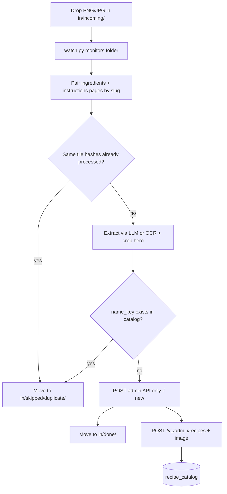
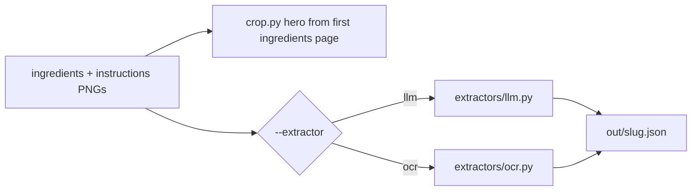

# Recipe Loader — Design & Ops Guide

Standalone **one-time ops utility** for importing recipes from mobile app screenshots into the DailyDiet catalog. Same category as `scripts/import_xlsm.py`.

**Not production code.** Lives only under `scripts/recipe_loader/`. Zero changes to `backend/app/`, `apps/web/`, or Docker. Uses the existing admin API as the only integration point.

---

## Overview



---

## Folder layout

```
scripts/recipe_loader/
├── README.md           ← this file (design reference)
├── watch.py            # Main entry: folder monitor + pipeline
├── extract.py          # One-off extract CLI
├── load.py             # Push JSON → admin API
├── pipeline.py         # extract → dedupe → push → archive
├── crop.py             # Hero image crop (Pillow)
├── pairing.py          # Group screenshots into recipe jobs
├── state.py            # Job state / idempotency on disk
├── normalize.py        # name_key (matches backend)
├── extractors/
│   ├── llm.py          # OpenAI vision
│   ├── ocr.py          # Tesseract + heuristics
│   └── manual.py       # Crop only, empty JSON scaffold
├── requirements.txt
├── requirements-ocr.txt
├── in/
│   ├── incoming/       # Watch target — drop files here
│   ├── done/           # Successfully pushed or extracted
│   ├── skipped/duplicate/
│   └── failed/         # + error.log
├── out/                # Extracted JSON + cropped images (audit trail)
└── state/
    ├── jobs.json
    └── catalog_keys.json
```

`in/`, `out/`, and `state/` are **gitignored**.

---

## Screenshot naming

### Single page (legacy)

```
in/incoming/pumkin-aloo-tikki__ingredients.png
in/incoming/pumkin-aloo-tikki__instructions.png
```

### Multiple pages (scroll continuation)

```
in/incoming/pumkin-aloo-tikki__ingredients__01.png
in/incoming/pumkin-aloo-tikki__ingredients__02.png
in/incoming/pumkin-aloo-tikki__instructions__01.png
in/incoming/pumkin-aloo-tikki__instructions__02.png
```

| Part | Meaning |
|------|---------|
| `pumkin-aloo-tikki` | Job slug (shared prefix = one recipe) |
| `__ingredients` / `__instructions` | Tab type |
| `__01`, `__02`, or `_01`, `_02` | Page order (optional; unnumbered = page 0) |

**Why double underscore before tab?** Slugs may contain single underscores (e.g. `Wheat_Upama__ingredients_01.png`).

**Page suffix:** both `__ingredients__01` and `__ingredients_01` work.

**Ignored automatically:** `:Zone.Identifier` sidecar files from Windows/WSL downloads.

**Extensions:** `.png`, `.jpg`, `.jpeg`, `.webp` — case-insensitive (`.PNG` works).

**Wrong folder:** use `in/incoming/` exactly (not `incomming`). **Optional exact catalog name:** `in/incoming/pumkin-aloo-tikki.name` (one line, matches meal-plan spelling). Catalog `name` must match normalized meal text in `public/data/meal-plan.json` (e.g. `Pumkin Aloo Tikki` — note spelling).

---

## Extraction backends

Switch via `--extractor` or env `RECIPE_EXTRACTOR`. Default: `llm`.



| Backend | Flag | Needs | Behavior |
|---------|------|-------|----------|
| **LLM** | `llm` (default) | `OPENAI_API_KEY`, optional `OPENAI_MODEL` | Vision API; all pages sent in order; merges ingredients + instructions |
| **OCR** | `ocr` | `tesseract-ocr`, `requirements-ocr.txt` | Tesseract per page; text merged; duplicate ingredient lines deduped |
| **Manual** | `manual` | Nothing | Crops hero photo only; writes empty JSON for hand-editing |

**Hero photo:** Always cropped from the **first** ingredients page (top ~40% of screenshot).

**Multi-page merge:**
- **LLM:** All ingredient pages then all instruction pages, labeled in prompt.
- **OCR:** Concatenate OCR text; ingredients deduped by `(amount, item)`.

---

## Duplicate prevention

**Default: never create a second catalog entry for the same recipe.**

Backend enforces unique `name_key` (`RecipeCatalogEntry.name_key`) and returns **409** on duplicate create. This utility checks **before** calling the API.

### name_key normalization

Mirrors `backend/app/meals.py`:

```python
def normalize_name_key(name: str) -> str:
    return re.sub(r"\s+", " ", name.strip().lower())
```

| name | name_key |
|------|----------|
| `Pumkin Aloo Tikki` | `pumkin aloo tikki` |
| `  Pumkin   Aloo  Tikki  ` | `pumkin aloo tikki` |

### Three-layer checks (in order)

| Layer | When | Action |
|-------|------|--------|
| **1. File hash** | Before extract | SHA-256 of **all** pages; if already in `state/jobs.json` as `pushed`, `skipped_duplicate`, or `extracted` → skip |
| **2. Local name_key** | After extract, before push | If in `state/catalog_keys.json` or prior `pushed` job → skip push |
| **3. Live catalog** | Before push | `GET /v1/recipes`; if `name_key` match → skip push |

On watcher startup, catalog cache is refreshed from `GET /v1/recipes`.

**No silent overwrites.** Use `--force-update` only to PATCH an existing entry (fix bad extraction).

---

## Target JSON (`out/{slug}.json`)

```json
{
  "name": "Pumkin Aloo Tikki",
  "display_name": "Pumpkin Aloo Tikki",
  "ingredients": [{ "amount": "1/2 cup", "item": "pumpkin (grated)" }],
  "instructions": "### Roast the Dalia:\n- Dry roast the wheat until golden brown.\n\n### Prepare the Tempering:\n- Heat oil in a pan.",
  "image_file": "pumkin-aloo-tikki.jpg",
  "source_screenshots": [
    "pumkin-aloo-tikki__ingredients__01.png",
    "pumkin-aloo-tikki__ingredients__02.png",
    "pumkin-aloo-tikki__instructions__01.png"
  ],
  "extractor": "llm",
  "slug": "pumkin-aloo-tikki"
}
```

Image uploaded separately via `POST /v1/admin/recipes/{id}/image`.

### Instructions format (Markdown)

The `instructions` field is **Markdown**. The web app renders it at `/recipes/:id` with section headings and bullets.

**LLM / OCR extractors emit:**
```markdown
### Roast the Dalia:
- Dry roast the wheat (dalia) until golden brown. Set aside.

### Prepare the Tempering:
- Heat oil in a pan. Add mustard seeds and cumin seeds. Let them splutter.
```

Legacy plain-text instructions still display (single newlines preserved via `remark-breaks`). Edit at `/recipes/:id/edit` or re-import with `--force-update`.

---

## API integration (load.py)

| Step | Endpoint | When |
|------|----------|------|
| List (cache) | `GET /v1/recipes` | Startup + after successful push |
| Create | `POST /v1/admin/recipes` | Only if `name_key` not in catalog |
| Image | `POST /v1/admin/recipes/{id}/image` | After successful create |
| Update | `PATCH /v1/admin/recipes/{id}` | Only with `--force-update` |

Auth header: `X-Admin-Key` (env `ADMIN_KEY` or `ADMIN_API_KEY`).

409 responses are treated as `skipped_duplicate`, not failure.

---

## Setup

```bash
cd scripts/recipe_loader
python3 -m venv .venv
source .venv/bin/activate
pip install -r requirements.txt

# OCR optional:
pip install -r requirements-ocr.txt
sudo apt install tesseract-ocr   # WSL, one-time
```

## Environment

```bash
export API_URL=http://localhost:3000
export ADMIN_KEY=dev-admin-key      # matches backend ADMIN_API_KEY
export OPENAI_API_KEY=sk-...        # only for --extractor llm
export OPENAI_MODEL=gpt-4o          # optional
export RECIPE_EXTRACTOR=llm         # optional default
```

---

## Usage

### Folder watch (primary workflow)

```bash
python watch.py --extractor llm
python watch.py --extractor ocr --poll          # WSL-friendly polling
python watch.py --no-push                       # extract only → review out/
python watch.py --review                        # same as --no-push
python watch.py --allow-partial                 # push without instructions
python watch.py --pair-timeout 120              # wait for instruction pages (seconds)
python watch.py --force-update                  # overwrite existing name_key
```

Runs until Ctrl+C. Processes files already in `in/incoming/` on startup.

### Manual extract + load

```bash
python extract.py --extractor manual --slug my-recipe \
  --ingredients page1.png page2.png \
  --instructions step1.png step2.png

python load.py out/my-recipe.json
python load.py out/*.json --dry-run
```

---

## Pipeline per job

1. **Debounce** — wait until file size stable (~2s)
2. **Pair** — group pages by slug + tab; wait for instruction pages unless `--allow-partial` or `--pair-timeout` elapsed
3. **Duplicate check (files)** — skip if same hashes already processed
4. **Extract** — chosen backend on all pages; crop hero from first ingredients page
5. **Write** — `out/{slug}.json` + `out/{slug}.jpg`
6. **Duplicate check (name_key)** — skip push if catalog already has recipe
7. **Push** — create + upload image (unless `--no-push`)
8. **Archive** — `in/done/{slug}/` | `in/skipped/duplicate/{slug}/` | `in/failed/{slug}/`
9. **State** — update `state/jobs.json`

### Console examples

```
[pumkin-aloo-tikki] PUSH ok — created id=15
[pumkin-aloo-tikki] SKIP duplicate — catalog already has name_key "pumkin aloo tikki" (id=12)
[pumkin-aloo-tikki] EXTRACT ok — wrote pumkin-aloo-tikki.json (--no-push)
```

---

## WSL notes

- Watch `in/incoming/` inside the WSL project path (`/home/.../DailyDiet/...`)
- If `watchdog` misses events, use `--poll`
- Copy phone screenshots into WSL `in/incoming/`

---

## Explicitly out of scope

- Production daemon, Docker service, or CI
- New backend routes or web UI import button
- Vision/OCR SDK in backend `requirements.txt`

---

## state/jobs.json entry shape

```json
{
  "pumkin-aloo-tikki": {
    "status": "pushed",
    "name_key": "pumkin aloo tikki",
    "recipe_id": 12,
    "file_hashes": ["abc...", "def...", "ghi..."],
    "extractor": "llm",
    "pushed_at": "2026-05-31T12:00:00Z",
    "updated_at": "2026-05-31T12:00:00Z"
  }
}
```

Status values: `pushed` | `skipped_duplicate` | `extracted` | `failed`
